# BÁO CÁO PHƯƠNG ÁN 2 — WEBSITE GIỚI THIỆU CÔNG TY THIÊN ĐỨC

| Thông tin | Nội dung |
|-----------|----------|
| **Dự án** | Website giới thiệu Công ty TNHH ĐT – XD – TM Thiên Đức |
| **Phương án** | Phương án 2 — Cân bằng giữa thời gian, chi phí và khả năng mở rộng |
| **Phiên bản tài liệu** | **2.1** (phân tích hệ thống PA2 hoàn chỉnh — FE + BE + Admin + Database) |
| **Ngày lập** | 12/06/2026 |
| **Trạng thái** | Bản trình phê duyệt triển khai |
| **Tài liệu tham chiếu** | `THIENDUC_DOCUMENT.txt`, `minh-hoa-bao-cao-pa2.md`, `cau-truc-hinh-anh.md`, `so-sanh-domain-trong-nuoc-va-vercel-moi.xlsx` |

---

## Tóm tắt

Website Thiên Đức là **trang giới thiệu doanh nghiệp** (corporate website), không phải thương mại điện tử. Mục tiêu: xây dựng uy tín, giới thiệu dự án/sản phẩm, hỗ trợ tư vấn qua form liên hệ, phục vụ tuyển dụng và thu hút nhà đầu tư.

**Phạm vi báo cáo:** **Phần 1** phân tích **hiện trạng** website và hệ thống, nêu **điểm tốt / chưa tốt**. **Phần 2** trình bày **thiết kế và đề xuất triển khai Phương án 2** (Next.js + CMS + NestJS + PostgreSQL). Nhân viên nội bộ không cần biết lập trình — tự cập nhật nội dung trên **trang quản trị CMS** sau khi hệ thống hoàn thiện.

**Thời gian triển khai ước lượng:** 8–10 tuần (website + API + admin + tích hợp + UAT + go-live).

**Minh họa:** Sơ đồ Mermaid, wireframe và Gantt → xem [`docs/minh-hoa-bao-cao-pa2.md`](minh-hoa-bao-cao-pa2.md).

---

# PHẦN 1 — PHÂN TÍCH HỆ THỐNG

## 1.1 Phân tích hệ thống (hiện trạng & đánh giá)

> **Phương pháp (theo góp ý review):** Phần 1 **chỉ mô tả hiện trạng** website/dự án và **đánh giá điểm tốt / chưa tốt**. Mọi **giải pháp, kiến trúc PA2, stack công nghệ, quy trình CMS, hosting** được trình bày ở **Phần 2 — Thiết kế**.

### 1.1.1 Bối cảnh và mục tiêu

Công ty Thiên Đức hoạt động đầu tư, xây dựng, phát triển bất động sản và dự án đô thị (thành lập **2010**). Website giới thiệu nhằm:

| Đối tượng | Mục đích sử dụng |
|-----------|------------------|
| Khách hàng / cư dân tiềm năng | Tìm hiểu công ty, xem dự án, liên hệ tư vấn |
| Nhà đầu tư | Đánh giá năng lực, portfolio, hợp tác phát triển |
| Ứng viên / nhân sự | Xem tuyển dụng, chính sách HR, sơ đồ tổ chức |
| Nội bộ (HR / Marketing) | *(Mục tiêu nghiệp vụ)* Cập nhật nội dung website **không phụ thuộc developer** |

**Phạm vi website:** Trang giới thiệu doanh nghiệp — **không** bán hàng, **không** tài khoản khách hàng, **không** thanh toán trực tuyến.

---

### 1.1.2 Hiện trạng hệ thống (06/2026)

Dự án đang ở giai đoạn **prototype giao diện frontend** — chưa go-live production, chưa có backend/admin hoàn chỉnh.

| Thành phần | Hiện trạng | Ghi chú |
|------------|------------|---------|
| **Website công khai** | ✅ Đang phát triển | Next.js 16, React 19, Tailwind CSS 4 |
| **Số trang / route** | ✅ ~12/14 route | Trang chủ, giới thiệu, dự án, tin tức, HR, liên hệ… |
| **Giao diện (UI)** | ✅ ~70% khung layout | Header, footer, section trang chủ, trang dự án mẫu |
| **Nguồn dữ liệu** | ⚠️ Tĩnh trong mã nguồn | Thư mục `src/data/` — cập nhật phải sửa code |
| **Ảnh / media** | ⚠️ Lưu local | `public/images/` — chưa CDN, chưa tối ưu hàng loạt |
| **Form liên hệ** | ⚠️ Mở ứng dụng mail | `mailto:` trên trình duyệt — **không** lưu CSDL, **không** email tự động cho admin |
| **Song ngữ Vi/En** | ❌ Chưa có | Chưa tích hợp `next-intl` / route `/vi`, `/en` |
| **SEO production** | ⚠️ Một phần | Có metadata cơ bản từng trang; chưa sitemap/robots go-live |
| **Backend API** | ❌ Chưa có | Chưa có NestJS, chưa có REST API |
| **Admin CMS** | ❌ Chưa có | Chưa có trang quản trị cho nhân viên nội bộ |
| **Database** | ❌ Chưa có | Chưa có PostgreSQL / lưu form & nội dung |
| **Domain / hosting** | ❌ Chưa production | Chạy local `localhost:3000`; chưa `thienduc.vn` |

**Mô hình vận hành hiện tại (rút gọn):**

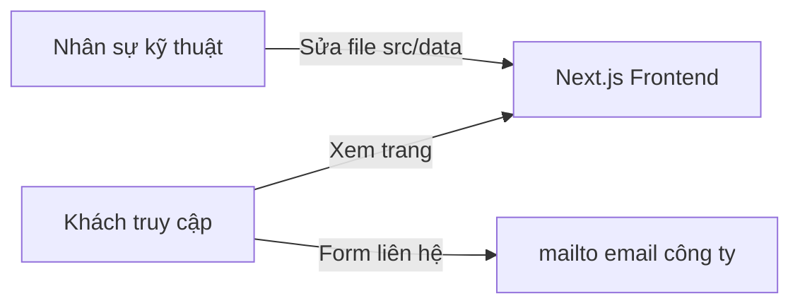
```mermaid
flowchart LR
    Dev[Nhân sự kỹ thuật] -->|Sửa file src/data| FE[Next.js Frontend]
    Khach[Khách truy cập] -->|Xem trang| FE
    Khach -->|Form liên hệ| Mail[mailto email công ty]
```

---

### 1.1.3 Hiện trạng nội dung & trải nghiệm người dùng

**Khách truy cập (hiện tại):**

| Nhu cầu | Đáp ứng hiện tại | Hạn chế |
|---------|------------------|---------|
| Xem giới thiệu, dự án, tin | ✅ Có trang demo + data mẫu | Nội dung gắn trong code, khó cập nhật thường xuyên |
| Xem 7 lĩnh vực, banner | ✅ Có section trang chủ | Banner/ảnh cần dev thay file |
| Liên hệ / tư vấn | ⚠️ Form → mở mail client | Không theo dõi trạng thái, dễ sót yêu cầu |
| Song ngữ | ❌ | Chỉ tiếng Việt |
| Mobile | ✅ Responsive cơ bản | Cần kiểm tra Lighthouse trước go-live |

**Nội bộ cập nhật nội dung (hiện tại):**

| Việc cần làm | Cách làm hiện tại | Vấn đề |
|--------------|-------------------|--------|
| Thêm/sửa dự án, tin, banner | Nhờ developer sửa `src/data` + ảnh trong `public/` | Không phù hợp HR/Marketing tự vận hành |
| Duyệt bài trước khi đăng | ❌ Không có quy trình | Rủi ro nội dung nếu sửa trực tiếp trên code |
| Quản lý form liên hệ | ❌ Không có danh sách tập trung | Chỉ nhận qua email cá nhân (khi khách gửi mail) |

---

### 1.1.4 Điểm tốt (ưu điểm hiện trạng)

| # | Điểm tốt | Giải thích |
|---|----------|------------|
| 1 | **Nền tảng kỹ thuật hiện đại** | Next.js 16 + React 19 + TypeScript — phù hợp SEO, mở rộng lâu dài |
| 2 | **Khung 14 trang đã có hướng đi rõ** | Route và layout chính đã dựng, giảm rủi ro thiết kế lại từ đầu |
| 3 | **UI theo nhận diện thương hiệu** | Tông trắng + nâu vàng `#B06613`, logo, cấu trúc header/footer thống nhất |
| 4 | **Có tài nguyên ảnh & nội dung mẫu** | Dự án Hưng Phú, banner, tin tức mẫu — làm reference triển khai thật |
| 5 | **Phân tách data tạm (`src/data`)** | Dễ migrate sang API sau này; code frontend không trộn logic backend |
| 6 | **Responsive** | Tailwind CSS 4 — hiển thị tốt trên mobile/tablet/desktop |

---

### 1.1.5 Điểm chưa tốt / hạn chế (cần xử lý ở Phần 2)

| # | Hạn chế | Tác động |
|---|---------|----------|
| 1 | **Nội dung hard-code** | Mỗi lần đổi tin/dự án phải nhờ dev → chậm, không bền vững |
| 2 | **Không có CMS / admin** | Nhân viên không biết code **không thể** tự cập nhật như yêu cầu nghiệp vụ |
| 3 | **Form liên hệ qua mailto** | Không lưu lịch sử, không phân trạng thái, dễ bỏ sót lead |
| 4 | **Thiếu backend & database** | Không có API, auth, workflow duyệt bài, backup dữ liệu |
| 5 | **Chưa song ngữ** | Chưa đáp ứng yêu cầu Vi/En toàn site |
| 6 | **Chưa production** | Chưa domain, SSL, staging/UAT, monitoring |
| 7 | **Ảnh chưa qua CDN** | Ảnh lớn/local có thể ảnh hưởng tốc độ khi scale |
| 8 | **SEO chưa hoàn thiện go-live** | Thiếu quy trình kiểm tra Lighthouse, sitemap production |

---

### 1.1.6 So sánh tham chiếu (website cùng ngành)

*Khảo sát công khai website xây dựng / BĐS — **không** phải benchmark chính thức.*

| Tiêu chí | **Thiên Đức (hiện trạng + mục tiêu)** | Đất Xanh Group | Novaland |
|----------|----------------------------------------|----------------|----------|
| Quy mô | DN vừa, TP.HCM + tỉnh | Tập đoàn BĐS lớn | Tập đoàn top đầu |
| Giao diện | Trắng + nâu vàng, hiện đại *(prototype)* | Rich media | Premium |
| Trang dự án | Đang dựng filter, gallery, map | Danh mục đa dạng | Showcase lớn |
| Form liên hệ | **mailto** *(hiện tại)* | Form + CRM | Form + hotline |
| CMS nội dung | **Chưa có** *(mục tiêu: có)* | CMS doanh nghiệp | CMS doanh nghiệp |
| Song ngữ | **Chưa có** *(mục tiêu: Vi/En)* | Vi + En | Vi + En |

**Nhận xét:** Hiện trạng mới dừng ở **frontend demo**. Để ngang tầm website giới thiệu doanh nghiệp trong ngành cần bổ sung **CMS, form có backend, song ngữ** — các hạng mục này sẽ được **đề xuất cụ thể ở Phần 2**.

---

### 1.1.7 Kết luận phần phân tích

Qua các mục 1.1.2–1.1.6, có thể rút ra các nhận định sau:

**1. Về mức độ hoàn thiện hệ thống**

Website Thiên Đức hiện mới dừng ở giai đoạn **prototype frontend** (~70% giao diện, ~12/14 trang). Đây là **nền tảng trình bày tốt**, nhưng **chưa phải hệ thống website có thể vận hành và bàn giao cho bộ phận nội bộ** — thiếu backend, cơ sở dữ liệu, trang quản trị CMS, môi trường production và quy trình xử lý form liên hệ tập trung.

**2. Về mức độ đáp ứng mục tiêu nghiệp vụ** *(tham chiếu mục 1.1.1)*

| Mục tiêu | Đánh giá hiện trạng |
|----------|---------------------|
| Khách hàng / nhà đầu tư xem thông tin công ty, dự án | ✅ **Đáp ứng một phần** — có trang demo và nội dung mẫu |
| Liên hệ tư vấn qua website | ❌ **Chưa đáp ứng đầy đủ** — form qua `mailto`, dễ sót yêu cầu, không theo dõi trạng thái |
| HR / Marketing tự cập nhật nội dung | ❌ **Chưa đáp ứng** — mọi thay đổi phụ thuộc developer |
| Chuẩn website doanh nghiệp trong ngành (CMS, song ngữ) | ❌ **Chưa đáp ứng** — còn khoảng cách so với đối thủ đã khảo sát |

**3. Điểm đáng tận dụng khi triển khai tiếp**

Nền frontend (Next.js, TypeScript, layout 14 trang, nhận diện thương hiệu) **đã được xây dựng**, giúp **giảm rủi ro thiết kế lại từ đầu** và rút ngắn thời gian hoàn thiện giai đoạn sau. Dữ liệu tách trong `src/data/` thuận lợi cho việc chuyển sang API khi có backend.

**4. Kết luận**

- **Hiện trạng** phù hợp để **demo nội bộ** và làm **cơ sở phát triển tiếp**, nhưng **chưa đủ điều kiện go-live** hay **vận hành lâu dài** theo yêu cầu doanh nghiệp.
- Cần bổ sung **lớp vận hành** (CMS, backend, database, form chuyên nghiệp, hosting production) để website thực sự phục vụ Marketing, HR và kinh doanh.
- Các **giải pháp kỹ thuật cụ thể** (Phương án 2) được trình bày tại **Phần 2 — Thiết kế**; mục **1.2** liệt kê yêu cầu chức năng phát sinh từ phân tích trên.

---
## 1.2 Yêu cầu chức năng (phát sinh từ hiện trạng & mục tiêu)

> **Lưu ý:** Bảng dưới mô tả **yêu cầu nghiệp vụ** cần đáp ứng. Cách triển khai kỹ thuật (API, CMS, database…) nằm ở **Phần 2**.

### 1.2.0 Danh sách chức năng tổng hợp

Chức năng chia theo **vai trò**. Khách truy cập **không có** tài khoản, không CRUD — chỉ **xem nội dung công khai** và **gửi form liên hệ** (không liệt kê như quyền quản trị).

### 1.2.1 Chức năng công khai (Website — khách truy cập)

| ID | Chức năng | Mô tả |
|----|-----------|--------|
| P01 | Trang chủ | Banner, giới thiệu, 7 lĩnh vực, dự án nổi bật, tin, CTA |
| P02 | Giới thiệu | Tổng quan, tầm nhìn, sứ mệnh |
| P03 | Danh sách dự án | Lọc trạng thái |
| P04 | Chi tiết dự án | Gallery, map, facts, CTA |
| P05 | Chi tiết hạng mục | Trang con hạng mục trong dự án |
| P06–P07 | Tin tức | List + detail |
| P08–P09 | HR + CTTV | Tuyển dụng, đào tạo, CSNS, sơ đồ TC, CTTV |
| P10 | Liên hệ | Phone, email, map, form |
| P11 | Gửi form | POST API → PostgreSQL + email admin |
| P12 | Song ngữ Vi/En | Locale switcher |
| P13 | SEO | Metadata, sitemap, OG, schema |
| P14 | Responsive | Mobile / tablet / desktop |

---

### 1.2.2 Chức năng quản trị — Editor (Nhân viên nội dung)

| ID | Chức năng | Mô tả | Giai đoạn |
|----|-----------|--------|-----------|
| E01 | Đăng nhập admin | JWT qua API | P0 |
| E02 | Dashboard | Xem liên hệ mới, bài nháp của mình | P0 |
| E03 | CRUD dự án (nháp) | Tạo/sửa/xóa — **không publish** | P1 |
| E04 | CRUD tin tức (nháp) | Soạn bài, gửi duyệt | P1 |
| E05 | Upload ảnh / video | Cloudinary; lưu URL vào CSDL | P1 |
| E06 | Sửa banner trang chủ | Nội dung + ảnh + thứ tự | P1 |
| E07 | Sửa trang tĩnh (nháp) | HR, giới thiệu mở rộng | P2 |
| E08 | **Đặt lịch đăng bài** | Chọn `published_at` tương lai | **Phase 2** *(PA2 cơ bản: publish thủ công; lịch tự động cần cron job)* |

---

### 1.2.3 Chức năng quản trị — Admin

| ID | Chức năng | Mô tả | Giai đoạn |
|----|-----------|--------|-----------|
| A01 | Tất cả quyền Editor | + publish | P1 |
| A02 | Duyệt & publish tin | DRAFT → PENDING → PUBLISHED | P1 |
| A03 | Publish dự án / banner | Hiển thị website | P1 |
| A04 | Quản lý form liên hệ | List, detail, đổi trạng thái, ghi chú nội bộ | P0 |
| A05 | Quản lý trang tĩnh | Publish nội dung HR, CTTV | P2 |
| A06 | Xem báo cáo nhanh | Số liên hệ theo trạng thái, tin chờ duyệt | P0 |

---

### 1.2.4 Chức năng quản trị — Super Admin

| ID | Chức năng | Mô tả | Giai đoạn |
|----|-----------|--------|-----------|
| S01 | Cài đặt site | Phone, email, địa chỉ, metadata global | P2 |
| S02 | Quản lý tài khoản | CRUD user Editor/Admin; khóa/mở | P2 |
| S03 | Phân quyền | SUPER_ADMIN / ADMIN / EDITOR | P2 |
| S04 | Cấu hình email | SMTP Gmail / Workspace | P0 |

**Ghi chú:** Giai đoạn đầu có thể chỉ **1 Super Admin**; mở rộng sau.

---

### 1.2.5 Ánh xạ 14 trang ↔ module CMS

| # | Trang | Route | Module admin |
|---|-------|-------|--------------|
| 1 | Trang chủ | `/` | Banner + Featured |
| 2 | Giới thiệu | `/gioi-thieu` | Trang tĩnh |
| 3 | Dự án | `/du-an` | Dự án |
| 4 | Chi tiết dự án | `/du-an/[slug]` | Dự án |
| 5 | Chi tiết hạng mục | `/du-an/[slug]/[hang-muc]` | Dự án → Hạng mục |
| 6–7 | Tin tức | `/tin-tuc`, `/tin-tuc/[slug]` | Tin tức |
| 8, 10 | Tuyển dụng | `/tuyen-dung` | Trang tĩnh |
| 9 | CTTV | `/cong-ty-thanh-vien` | Trang tĩnh |
| 11–13 | Sơ đồ TC, Đào tạo, CSNS | `/so-do-...`, `/dao-tao`, `/chinh-sach-...` | Trang tĩnh + media |
| 14 | Liên hệ | `/lien-he` | Cài đặt + Form (read) |

---

## 1.3 Sơ đồ tham chiếu (kiến trúc đề xuất — xem chi tiết Phần 2)

> **Lưu ý:** Các sơ đồ dưới đây mô tả **hệ thống mục tiêu (PA2)** sau triển khai — **không phải hiện trạng**. Phân tích hiện trạng nằm ở mục **1.1.2–1.1.5**. Thiết kế chi tiết: **Phần 2**.
>
> File draw.io: `docs/diagrams/01-dang-nhap.drawio` … `09-xu-ly-form.drawio` (01–03 chi tiết; 04–07 tổng quan; 08–09 chi tiết bổ sung)  
> Diagram 02: lane Admin = **Vite + React** (không phải Next.js).  
> **Minh họa PNG:** `04`–`09` trong `docs/diagrams/` (chèn Word mục 1.3.1–1.3.3, 1.3.5, 1.3.6).

### 1.3.1 Sơ đồ tính năng tổng quan

Sơ đồ dưới mô tả **4 nhóm chức năng** theo vai trò (khách, Editor, Admin, hạ tầng) — **hệ thống mục tiêu PA2**.

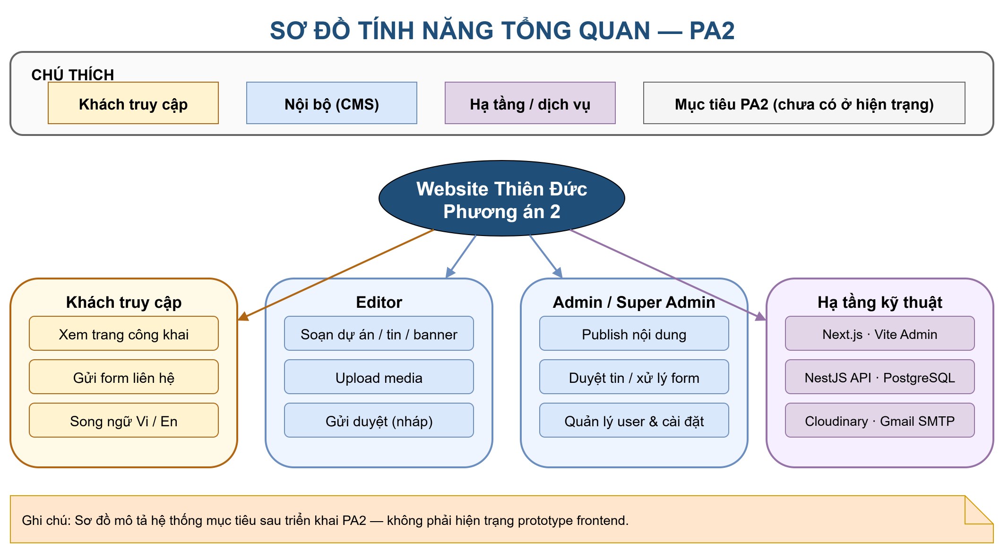

*Tóm tắt:* Khách **xem + form + song ngữ** · Editor **soạn/upload/gửi duyệt** · Admin **publish, duyệt, xử lý form, quản trị** · Hạ tầng **Next.js, Vite Admin, NestJS, PostgreSQL, Cloudinary, Gmail*.

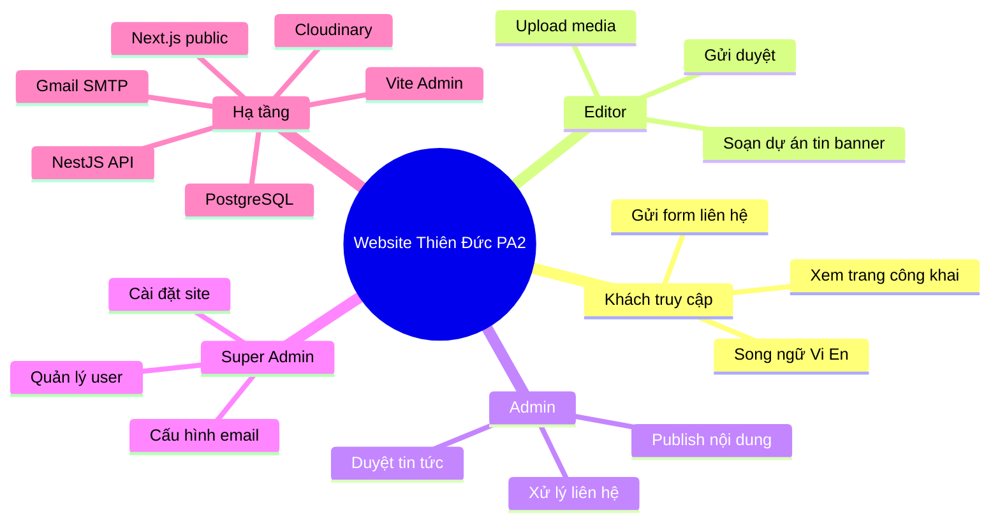
```mermaid
mindmap
  root((Website Thiên Đức PA2))
    Khách truy cập
      Xem trang công khai
      Gửi form liên hệ
      Song ngữ Vi En
    Editor
      Soạn dự án tin banner
      Upload media
      Gửi duyệt
    Admin
      Publish nội dung
      Xử lý liên hệ
      Duyệt tin tức
    Super Admin
      Quản lý user
      Cài đặt site
      Cấu hình email
    Hạ tầng
      Next.js public
      Vite Admin
      NestJS API
      PostgreSQL
      Cloudinary
      Gmail SMTP
```

---

### 1.3.2 Sơ đồ kiến trúc tổng thể (3 tầng)

Kiến trúc **3 tầng + lưu trữ**: người dùng → giao diện (website + admin) → API → PostgreSQL / Cloudinary / Gmail.

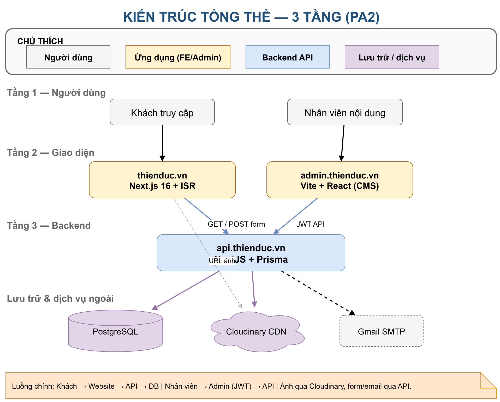

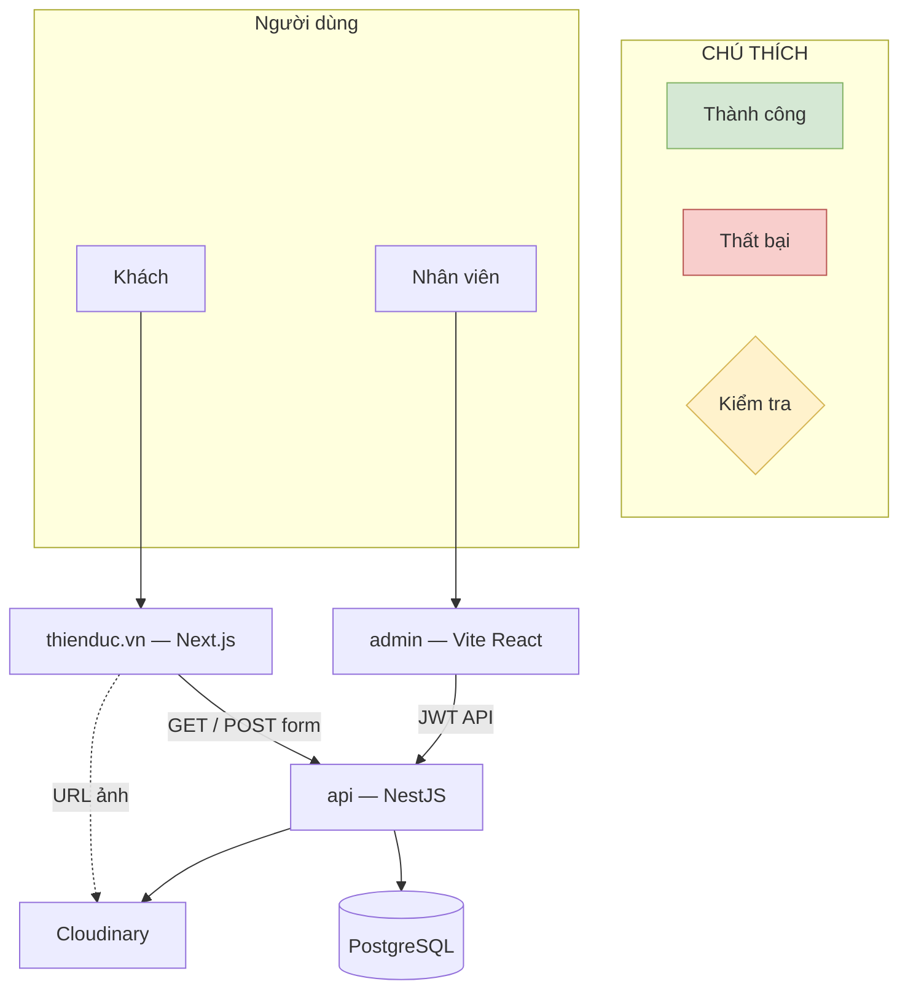
```mermaid
flowchart TB
    subgraph legend["CHÚ THÍCH"]
        direction LR
        L1[Thành công]
        L2[Thất bại]
        L3{Kiểm tra}
    end

    subgraph users["Người dùng"]
        Guest[Khách]
        Staff[Nhân viên]
    end

    WEB["thienduc.vn — Next.js"]
    ADM["admin — Vite React"]
    API["api — NestJS"]
    DB[(PostgreSQL)]
    CDN[Cloudinary]

    Guest --> WEB
    Staff --> ADM
    WEB -->|GET / POST form| API
    ADM -->|JWT API| API
    API --> DB
    API --> CDN
    WEB -.->|URL ảnh| CDN

    style L1 fill:#D5E8D4,stroke:#82B366
    style L2 fill:#F8CECC,stroke:#B85450
    style L3 fill:#FFF2CC,stroke:#D6B656
```

---

### 1.3.3 Sơ đồ luồng dữ liệu — DFD mức 0

Khách và nhân viên tương tác với hệ thống PA2; dữ liệu lưu DB, media qua Cloudinary, email qua Gmail.

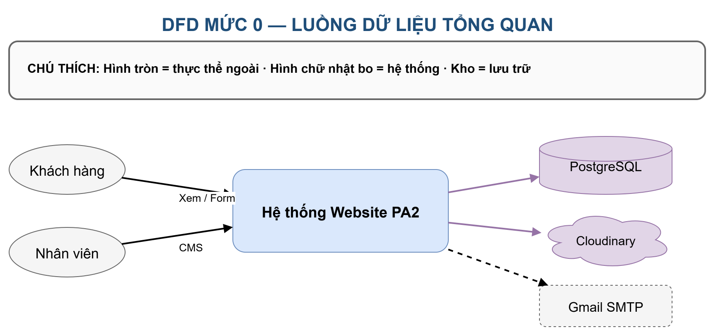

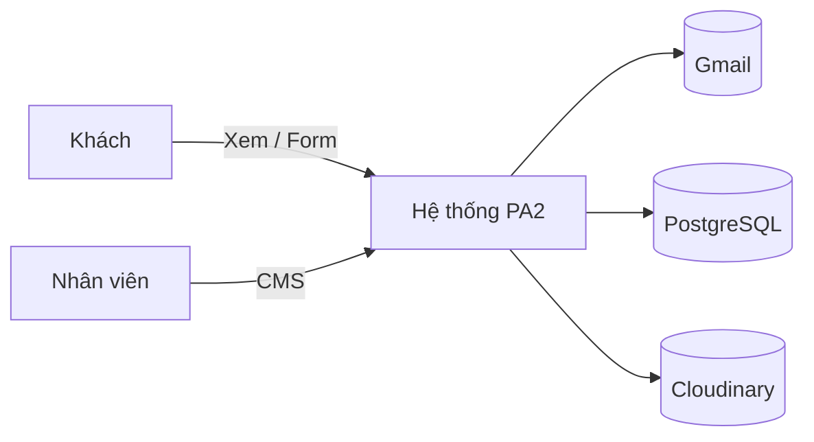
```mermaid
flowchart LR
    K[Khách] -->|Xem / Form| P0[Hệ thống PA2]
    NV[Nhân viên] -->|CMS| P0
    P0 --> Gmail[(Gmail)]
    P0 --> DB[(PostgreSQL)]
    P0 --> CDN[(Cloudinary)]
```

---

### 1.3.4 Sơ đồ luồng dữ liệu — DFD mức 1

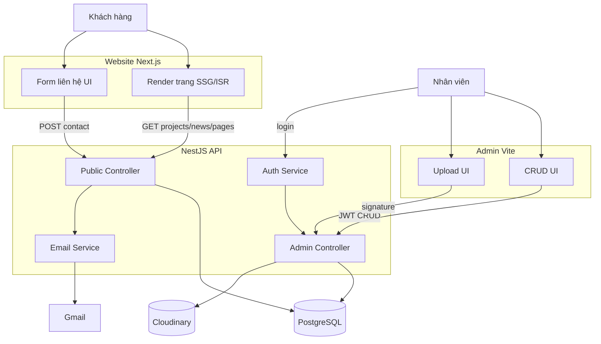
```mermaid
flowchart TB
    K[Khách hàng]
    NV[Nhân viên]

    subgraph frontend [Website Next.js]
        W1[Render trang SSG/ISR]
        W2[Form liên hệ UI]
    end

    subgraph adminapp [Admin Vite]
        A1[CRUD UI]
        A2[Upload UI]
    end

    subgraph api [NestJS API]
        AP1[Public Controller]
        AP2[Admin Controller]
        AP3[Auth Service]
        AP4[Email Service]
    end

    DB[(PostgreSQL)]
    CDN[(Cloudinary)]
    Mail[Gmail]

    K --> W1
    K --> W2
    NV --> A1
    NV --> A2

    W1 -->|GET projects/news/pages| AP1
    W2 -->|POST contact| AP1
    A1 -->|JWT CRUD| AP2
    A2 -->|signature| AP2

    AP1 --> DB
    AP2 --> DB
    AP2 --> CDN
    AP1 --> AP4
    AP4 --> Mail
    AP3 --> AP2
    NV -->|login| AP3
```

---

### 1.3.5 Sơ đồ cơ sở dữ liệu (ERD)

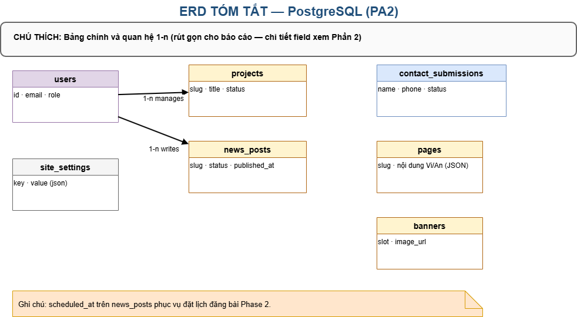

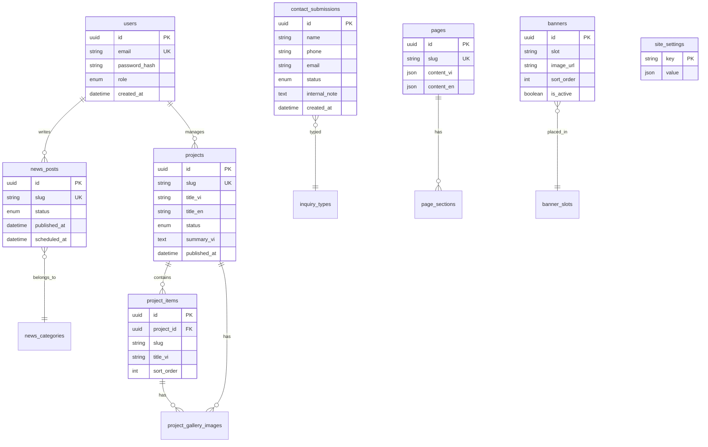
```mermaid
erDiagram
    users ||--o{ news_posts : writes
    users ||--o{ projects : manages

    projects ||--o{ project_items : contains
    projects ||--o{ project_gallery_images : has
    project_items ||--o{ project_gallery_images : has

    news_posts }o--|| news_categories : belongs_to
    contact_submissions }o--|| inquiry_types : typed
    pages ||--o{ page_sections : has
    banners }o--|| banner_slots : placed_in

    users {
        uuid id PK
        string email UK
        string password_hash
        enum role
        datetime created_at
    }

    projects {
        uuid id PK
        string slug UK
        string title_vi
        string title_en
        enum status
        text summary_vi
        datetime published_at
    }

    project_items {
        uuid id PK
        uuid project_id FK
        string slug
        string title_vi
        int sort_order
    }

    news_posts {
        uuid id PK
        string slug UK
        enum status
        datetime published_at
        datetime scheduled_at
    }

    contact_submissions {
        uuid id PK
        string name
        string phone
        string email
        enum status
        text internal_note
        datetime created_at
    }

    pages {
        uuid id PK
        string slug UK
        json content_vi
        json content_en
    }

    banners {
        uuid id PK
        string slot
        string image_url
        int sort_order
        boolean is_active
    }

    site_settings {
        string key PK
        json value
    }
```

*Ghi chú:* Trường `scheduled_at` trên `news_posts` phục vụ **đặt lịch đăng bài Phase 2**.

---

### 1.3.6 Sơ đồ chức năng chi tiết

#### (1) Đăng nhập Admin

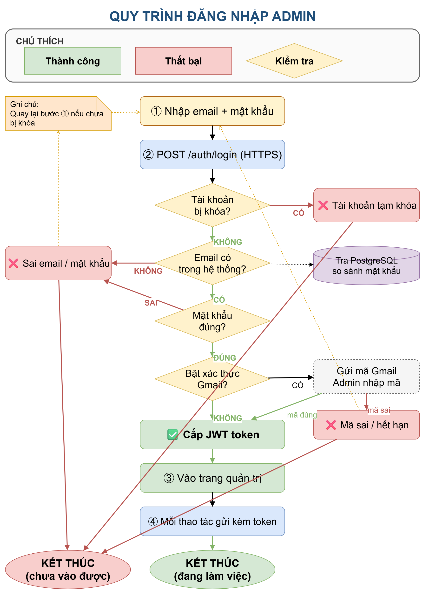

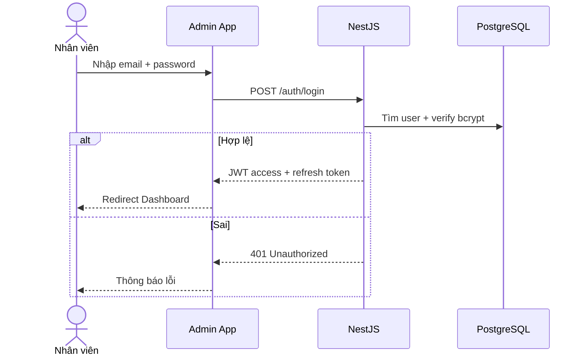
```mermaid
sequenceDiagram
    actor U as Nhân viên
    participant ADM as Admin App
    participant API as NestJS
    participant DB as PostgreSQL

    U->>ADM: Nhập email + password
    ADM->>API: POST /auth/login
    API->>DB: Tìm user + verify bcrypt
    alt Hợp lệ
        API-->>ADM: JWT access + refresh token
        ADM-->>U: Redirect Dashboard
    else Sai
        API-->>ADM: 401 Unauthorized
        ADM-->>U: Thông báo lỗi
    end
```

#### (2) Khách gửi form liên hệ

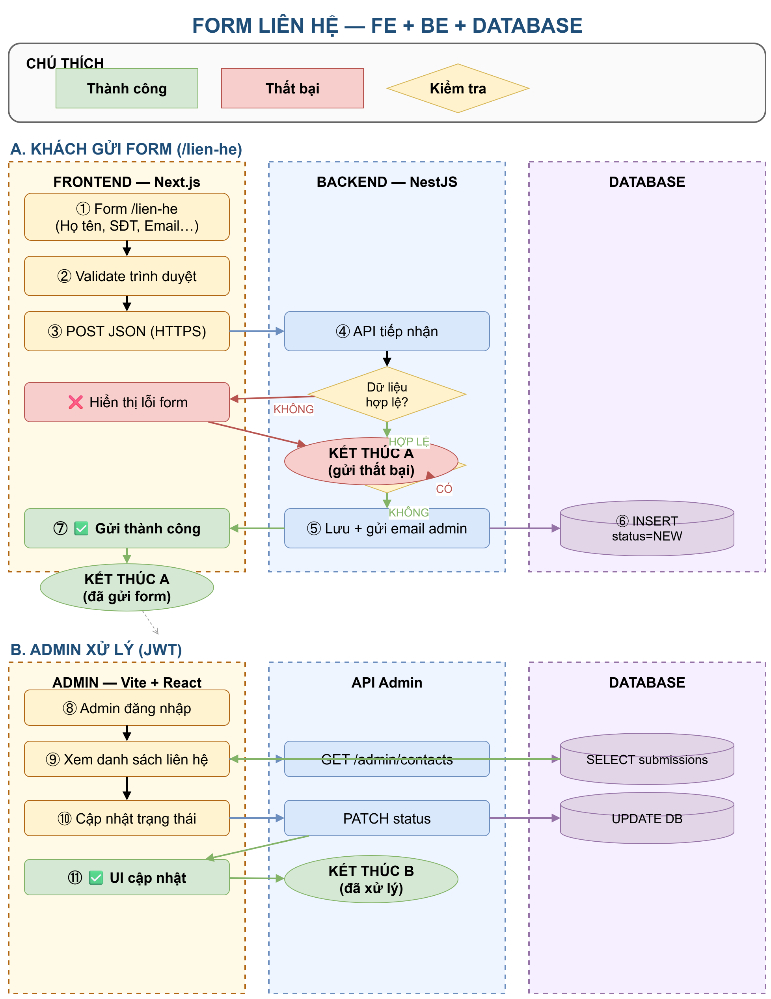

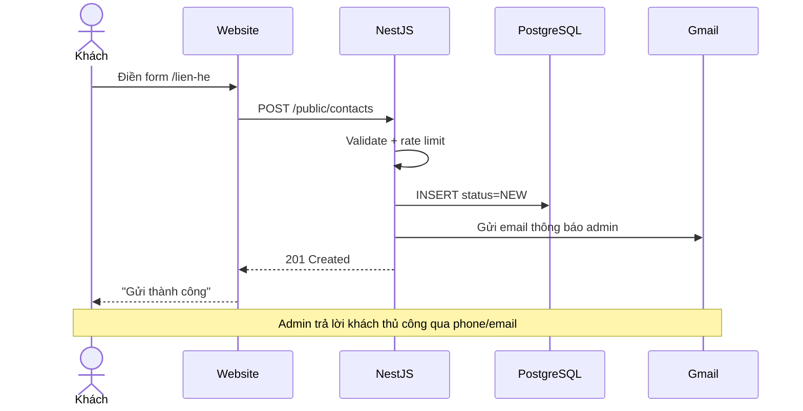
```mermaid
sequenceDiagram
    actor K as Khách
    participant WEB as Website
    participant API as NestJS
    participant DB as PostgreSQL
    participant Mail as Gmail

    K->>WEB: Điền form /lien-he
    WEB->>API: POST /public/contacts
    API->>API: Validate + rate limit
    API->>DB: INSERT status=NEW
    API->>Mail: Gửi email thông báo admin
    API-->>WEB: 201 Created
    WEB-->>K: "Gửi thành công"
    Note over K,Mail: Admin trả lời khách thủ công qua phone/email
```

#### (3) Upload ảnh Cloudinary

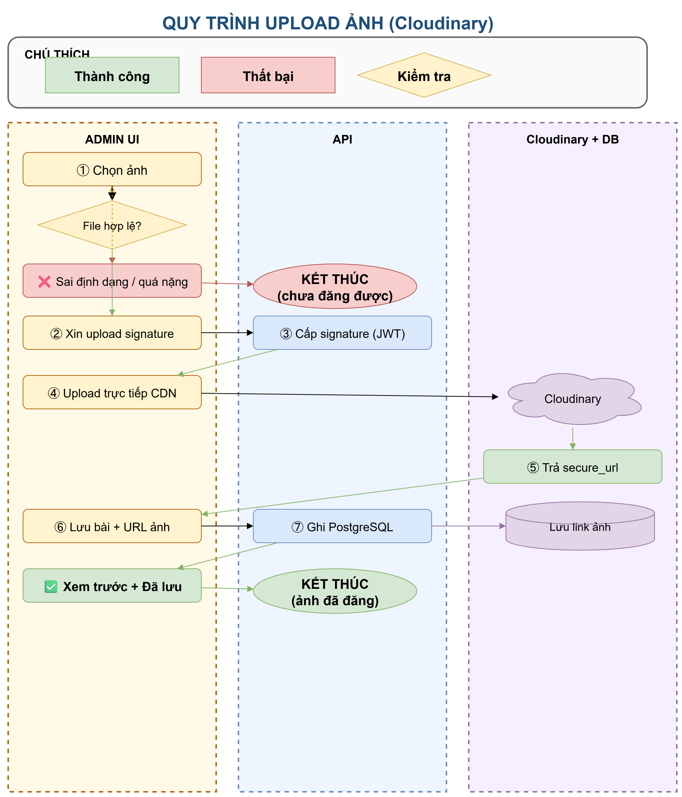

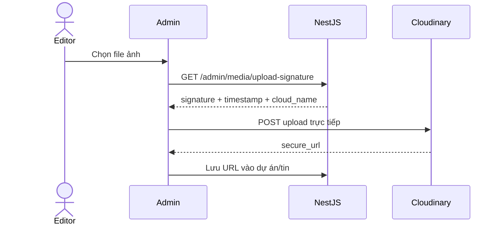
```mermaid
sequenceDiagram
    actor NV as Editor
    participant ADM as Admin
    participant API as NestJS
    participant CDN as Cloudinary

    NV->>ADM: Chọn file ảnh
    ADM->>API: GET /admin/media/upload-signature
    API-->>ADM: signature + timestamp + cloud_name
    ADM->>CDN: POST upload trực tiếp
    CDN-->>ADM: secure_url
    ADM->>API: Lưu URL vào dự án/tin
```

#### (4) Duyệt tin tức

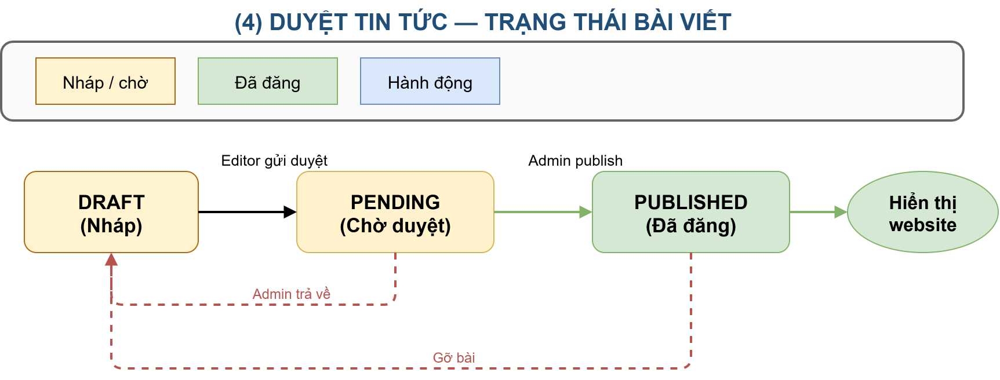

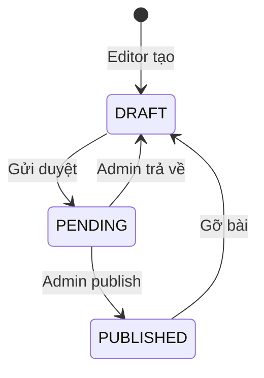
```mermaid
stateDiagram-v2
    [*] --> DRAFT: Editor tạo
    DRAFT --> PENDING: Gửi duyệt
    PENDING --> DRAFT: Admin trả về
    PENDING --> PUBLISHED: Admin publish
    PUBLISHED --> DRAFT: Gỡ bài
```

#### (5) Xử lý form liên hệ (Admin)

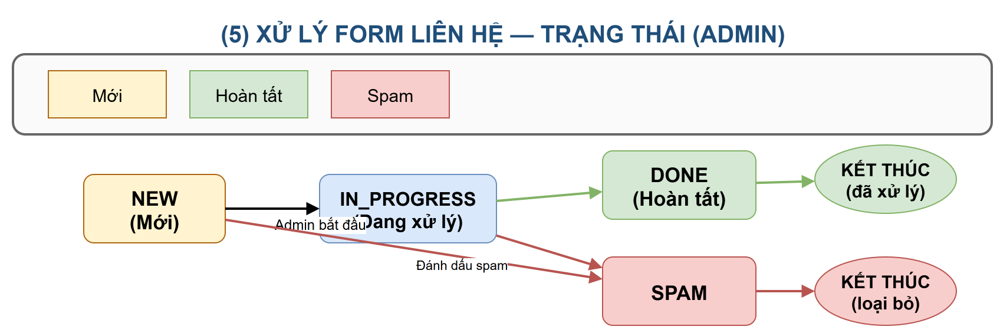

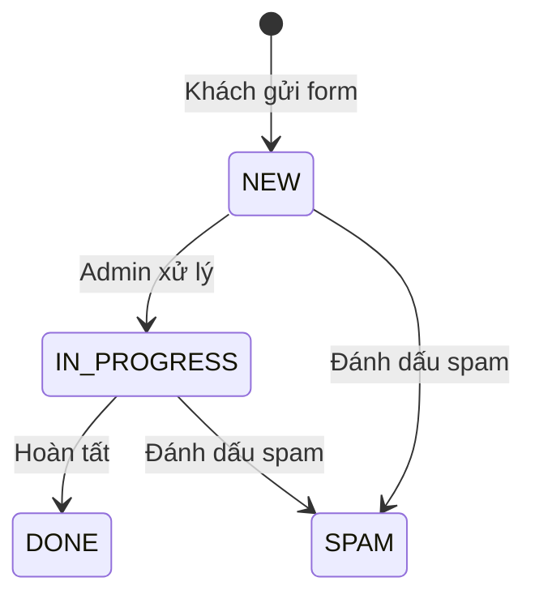
```mermaid
stateDiagram-v2
    [*] --> NEW: Khách gửi form
    NEW --> IN_PROGRESS: Admin xử lý
    IN_PROGRESS --> DONE: Hoàn tất
    NEW --> SPAM: Đánh dấu spam
    IN_PROGRESS --> SPAM: Đánh dấu spam
```

#### (6) Đặt lịch đăng bài (Phase 2)

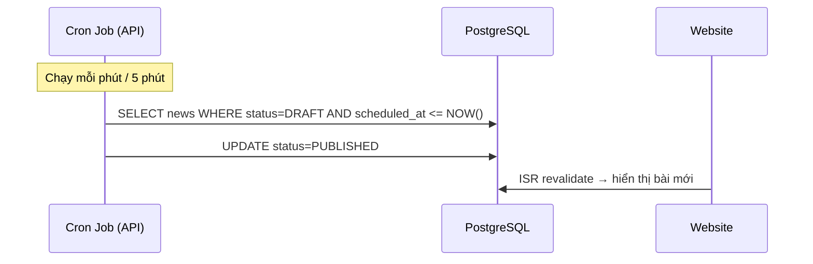
```mermaid
sequenceDiagram
    participant CRON as Cron Job (API)
    participant DB as PostgreSQL
    participant WEB as Website

    Note over CRON: Chạy mỗi phút / 5 phút
    CRON->>DB: SELECT news WHERE status=DRAFT AND scheduled_at <= NOW()
    CRON->>DB: UPDATE status=PUBLISHED
    WEB->>DB: ISR revalidate → hiển thị bài mới
```

> Export draw.io sang PNG: xem [`minh-hoa-bao-cao-pa2.md` — H7](minh-hoa-bao-cao-pa2.md)

---

# PHẦN 2 — THIẾT KẾ (PHƯƠNG ÁN 2)

## 2.1 Thiết kế Frontend (Website công khai)

### 2.1.1 Yêu cầu giao diện

| Hạng mục | Quy định |
|----------|----------|
| Phong cách | Doanh nghiệp hiện đại, sáng, uy tín — trắng chủ đạo |
| Màu chính | `#B06613` (nâu vàng), `#c99248`, `#fdcd04` (accent) |
| Nền / chữ | `#FFFFFF`, `#F2F2F2`, `#191919`, `#8f8f8f` |
| Logo / favicon | `public/images/brand/` |
| Font hiện tại | Geist Sans (Next.js Google Font) — *xác nhận font chính thức* |
| Responsive | Mobile-first; breakpoint Tailwind 4 |
| Song ngữ | Prefix `/vi/`, `/en/` (đề xuất) |
| Animation | Fade/reveal nhẹ — không block render |

> Wireframe: [`minh-hoa-bao-cao-pa2.md` — H3, H4, H5](minh-hoa-bao-cao-pa2.md)

---

### 2.1.2 Công nghệ Frontend — bảng so sánh và lựa chọn

Bảng dưới liệt kê **công nghệ đề xuất cho website công khai** (Phương án 2) và lý do chọn từng thành phần. Mục tiêu: dễ bảo trì, tối ưu hiển thị trên Google, tận dụng phần mã nguồn đã có (~70%).

| Lớp công nghệ | Lựa chọn PA2 | Phiên bản | Lý do chọn (diễn giải ngắn) |
|---------------|--------------|-----------|------------------------------|
| Nền tảng website | **Next.js** (App Router) | 16.2.6 | Hỗ trợ SEO, tạo trang tĩnh/tái tạo theo chu kỳ (ISR), phù hợp site giới thiệu; team đã có sẵn mã nguồn |
| Thư viện giao diện | **React** | 19.2.4 | Chuẩn ngành, đồng bộ với Admin CMS |
| Ngôn ngữ lập trình | **TypeScript** | ^5 | Giảm lỗi khi phát triển; cùng ngôn ngữ với backend |
| Trình bày giao diện | **Tailwind CSS** | ^4 | Xây responsive nhanh, thống nhất với Admin |
| Bộ icon | **lucide-react** | ^1.17 | Nhẹ, không phụ thuộc thư viện nặng |
| Song ngữ Vi/En | **next-intl** *(đề xuất)* | mới nhất | Tích hợp tốt với Next.js App Router |
| Kiểm tra chất lượng mã | **ESLint** | ^9 | Giữ chuẩn code trước khi đưa lên production |

#### So sánh nền tảng làm website công khai

*Ghi chú đọc bảng:* **Phù hợp** = đáp ứng tốt yêu cầu Thiên Đức · **Không phù hợp** = không nên dùng cho website công khai · **Được chọn** = phương án PA2 chốt dùng.

| Tiêu chí đánh giá | Next.js | Vite + React (SPA) | WordPress |
|-------------------|---------|---------------------|-----------|
| Khả năng SEO / hiển thị trên công cụ tìm kiếm | **Rất tốt** — server render & ISR | Kém hơn — cần bổ sung SSR | Tốt — có sẵn plugin |
| Tốc độ triển khai PA2 | Tốt — đã có ~70% mã nguồn | Rất nhanh cho app nội bộ | Trung bình — phụ thuộc theme/plugin |
| Phù hợp làm website công khai | **Phù hợp — được chọn** | Không phù hợp *(chỉ dùng cho trang Admin)* | Không tái sử dụng mã hiện tại |
| Bảo trì dài hạn | **Tốt** | Tốt | Phụ thuộc plugin bên thứ ba |
| **Kết luận PA2** | **Được chọn** | Chỉ dùng cho CMS nội bộ | Không chọn |

---

### 2.1.3 Chức năng bắt buộc trên giao diện

| Khu vực | Thành phần |
|---------|------------|
| Header | Logo, menu 7 mục, submenu, search, **VI/EN**, CTA |
| Top strip | Địa chỉ (Google Maps), phone (`tel:`), email (`mailto:`) |
| Trang chủ | Banner slider, 7 lĩnh vực, dự án nổi bật, tin, CTA |
| Dự án | Card, filter, gallery, map, link hạng mục |
| Liên hệ | Form 5 trường, bản đồ, validation client |
| Footer | Thông tin công ty, link, social *(nếu có)* |
| SEO | 1 H1/trang, alt ảnh, metadata, OG |

---

### 2.1.4 Hiệu năng tải trang

| Chỉ số | Hiện trạng (local prod) | Mục tiêu go-live |
|--------|-------------------------|------------------|
| TTFB `/` | 204 ms | < 600 ms (CDN VN) |
| TTFB `/lien-he` | 66 ms | < 400 ms |
| HTML size `/` | 95 KB | < 150 KB |
| LCP | *Chưa đo Lighthouse* | < 2,5 s |
| CLS | *Chưa đo* | < 0,1 |
| Lighthouse Perf mobile | *Chưa đo* | ≥ 70 |

**Biện pháp:** `next/image`, WebP, Cloudinary transform, ISR 60–300s, lazy load gallery.

---

## 2.2 Thiết kế Backend + Cơ sở dữ liệu

### 2.2.1 Kiến trúc Backend

| Thành phần | Lựa chọn PA2 |
|------------|--------------|
| Framework | **NestJS** (Node.js + TypeScript) |
| ORM | **Prisma** |
| Database | **PostgreSQL** |
| Auth | JWT (access + refresh) |
| Email | Gmail SMTP / Google Workspace |
| Media | Cloudinary |
| Validation | class-validator + Zod (admin) |
| Rate limit | `@nestjs/throttler` trên POST contact |

---

### 2.2.2 So sánh cơ sở dữ liệu (4 loại)

Website Thiên Đức cần lưu **dữ liệu có quan hệ** (dự án → hạng mục → ảnh; tin tức → trạng thái duyệt; form liên hệ → trạng thái xử lý). Bảng dưới so sánh bốn loại công nghệ lưu trữ thường gặp.

*Ghi chú cột Redis:* Redis **không phải** cơ sở dữ liệu chính; chỉ phù hợp làm **bộ nhớ đệm (cache)** ở giai đoạn mở rộng (Phase 2) khi lượng truy cập tăng.

| Tiêu chí đánh giá | **PostgreSQL** | MySQL | MongoDB | Redis |
|-------------------|----------------|-------|---------|-------|
| Quan hệ dự án ↔ hạng mục ↔ thư viện ảnh | **Rất tốt** — khóa ngoại, truy vấn JOIN | Rất tốt — tương tự PostgreSQL | Trung bình — nhúng hoặc tham chiếu tài liệu | **Không phù hợp** — không lưu quan hệ phức tạp |
| Form liên hệ + phân quyền người dùng | **Rất tốt** | Rất tốt | Trung bình | **Không phù hợp** — không thay thế CSDL chính |
| Quy trình duyệt tin (nháp → chờ duyệt → đăng) | **Tốt** — ràng buộc trạng thái rõ ràng | Tốt | Linh hoạt nhưng kém đảm bảo giao dịch | **Không phù hợp** |
| Tích hợp Prisma (công cụ truy cập dữ liệu) | **Hỗ trợ đầy đủ** | Hỗ trợ đầy đủ | Có hỗ trợ | **Không dùng làm CSDL chính** |
| Lưu nội dung trang tĩnh dạng khối (JSON) | **JSONB mạnh** | JSON cơ bản | JSON gốc | **Không phù hợp** |
| Tìm kiếm full-text tiếng Việt | Tốt — có extension | Tốt | Tốt | **Không phù hợp** |
| Sao lưu / phục hồi trên cloud | **Dễ** — Render, Neon… | Tương tự | MongoDB Atlas | Chỉ snapshot cache |
| Phù hợp website giới thiệu doanh nghiệp | **Tối ưu — được chọn** | Thay thế được | Dư thừa cho quy mô hiện tại | Chỉ bổ sung cache (Phase 2) |
| Tải 100–5.000 lượt truy cập/ngày | **Đáp ứng** | Đáp ứng | Đáp ứng | Không áp dụng ở vai trò CSDL chính |
| **Kết luận PA2** | **Được chọn PostgreSQL** | Có thể thay thế | Không ưu tiên | Bổ sung sau khi cần tăng tốc |

**Lý do chọn PostgreSQL:** Dữ liệu Thiên Đức **quan hệ rõ** (dự án → hạng mục → ảnh; tin → category; liên hệ → trạng thái); cần **ACID** cho form và workflow duyệt; Prisma + NestJS ecosystem mạnh; hosting managed giá hợp lý.

---

### 2.2.3 So sánh nền tảng Backend (API)

Backend xử lý đăng nhập CMS, lưu form liên hệ, quản lý dự án/tin tức và gửi email thông báo.

| Tiêu chí đánh giá | **NestJS** (Node.js + TypeScript) | Laravel (PHP) | Spring Boot (Java) |
|-------------------|-----------------------------------|---------------|---------------------|
| Cùng ngôn ngữ TypeScript với frontend | **Có — thuận lợi** | Không — PHP riêng | Không — Java riêng |
| Chia module (xác thực, CRUD, email…) | **Tốt** | Tốt | Tốt |
| Tốc độ triển khai PA2 | **Nhanh** | Trung bình | Chậm hơn — cấu hình nặng |
| Độ khó với team hiện tại | **Thấp** — đã quen TypeScript | Trung bình | Cao |
| **Kết luận PA2** | **Được chọn** | Không chọn | Không chọn |

---

### 2.2.4 So sánh lưu trữ media (ảnh, video)

| Tiêu chí đánh giá | **Cloudinary** | Lưu trên VPS/máy chủ | AWS S3 |
|-------------------|----------------|----------------------|--------|
| Tự động resize / chuyển WebP | **Có sẵn** | Phải xử lý thủ công | Phải cấu hình thêm (Lambda) |
| Phân phối qua CDN toàn cầu | **Có sẵn** | Phụ thuộc nhà cung cấp host | Có |
| Admin upload trực tiếp từ trình duyệt | **Có** — chữ ký bảo mật (signature) | Phức tạp — phải qua API trung gian | Trung bình |
| Chi phí giai đoạn đầu | Gói miễn phí (free tier) | Gộp trong chi phí VPS | Trả theo mức dùng |
| **Kết luận PA2** | **Được chọn** | Không chọn | Có thể thay thế sau |

---

### 2.2.5 API endpoint (tóm tắt)

**Public:** `GET /public/projects`, `/news`, `/pages/:slug`, `/banners`, `/settings/contact` · `POST /public/contacts`

**Admin (JWT):** `/auth/login` · CRUD `/admin/projects`, `/news`, `/pages`, `/banners` · `/admin/contacts` · `/admin/media/upload-signature` · `/admin/users`, `/admin/settings`

*Danh sách endpoint đầy đủ nằm ở mục 2.2.5 trong báo cáo này.*

---

## 2.3 Thiết kế Admin CMS (Vite + React)

| Hạng mục | Lựa chọn |
|----------|----------|
| Framework | Vite + React + TypeScript |
| UI | shadcn/ui + Tailwind CSS |
| Data | TanStack Query |
| Form | React Hook Form + Zod |
| Auth | JWT |
| Deploy | `admin.thienduc.vn` |

> Wireframe Dashboard + Sửa dự án: [`minh-hoa-bao-cao-pa2.md` — H4, H5](minh-hoa-bao-cao-pa2.md)

---

## 2.4 Thiết kế Hosting & hạ tầng

### 2.4.1 So sánh hosting Frontend (website + admin)

| Tiêu chí đánh giá | **Vercel** | VPS Việt Nam (VD: AZDigi, Viettel IDC) | Hosting PHP dùng chung |
|-------------------|------------|----------------------------------------|---------------------------|
| Tối ưu cho Next.js | **Rất tốt** | Cần tự cài Docker + Node.js | **Không hỗ trợ** Next.js |
| Triển khai khi push Git | **Tự động** | Thủ công hoặc qua CI | Hạn chế |
| Chứng chỉ SSL (HTTPS) | Tự động | Cấu hình Let's Encrypt | Thường có sẵn |
| CDN biên toàn cầu | **Có** | Một vùng (thường Việt Nam) | Một máy chủ |
| Chi phí ước tính/tháng | 0–20 USD | 200.000–800.000 VND | 50.000–150.000 VND |
| Phù hợp PA2 | **Được chọn** | Dự phòng khi cần dữ liệu trong nước | Không chọn |
| **Kết luận PA2** | **Host website + admin tĩnh** | Dự phòng / compliance | Không chọn |

---

### 2.4.2 So sánh hosting Backend + Database

| Tiêu chí đánh giá | **Render / Railway** | VPS Việt Nam tự quản | Neon (DB) + VPS API |
|-------------------|----------------------|----------------------|---------------------|
| Triển khai NestJS | **Một bước (Docker)** | Linh hoạt — tự cài đặt | Tách riêng DB và API |
| PostgreSQL do nhà cung cấp quản lý | **Có — gộp gói** | Tự cài + tự sao lưu | **Có — Neon free tier** |
| Nâng cấp cấu hình (scale dọc) | **Dễ** | Thủ công | Trung bình |
| Chi phí ước tính/tháng | 7–25 USD | 300.000–1.000.000 VND | 0–15 USD |
| Giám sát hệ thống (monitoring) | Có sẵn trên nền tảng | Tự cấu hình | Trung bình |
| **Kết luận PA2** | **Được chọn** | Khi scale lớn / yêu cầu lưu trữ trong nước | Có thể kết hợp |

---

### 2.4.3 Kiến trúc hosting đề xuất (sơ đồ)

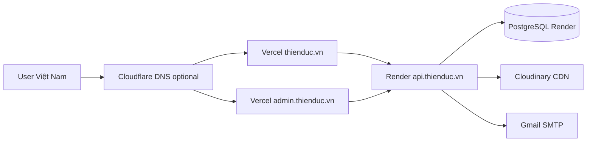
```mermaid
flowchart LR
    UserVN[User Việt Nam] --> CF[Cloudflare DNS optional]
    CF --> VercelWeb[Vercel thienduc.vn]
    CF --> VercelAdmin[Vercel admin.thienduc.vn]
    VercelWeb --> RenderAPI[Render api.thienduc.vn]
    VercelAdmin --> RenderAPI
    RenderAPI --> PG[(PostgreSQL Render)]
    RenderAPI --> Cloudinary[Cloudinary CDN]
    RenderAPI --> Gmail[Gmail SMTP]
```

---

### 2.4.4 Domain & subdomain

| Host | Mục đích |
|------|----------|
| `thienduc.vn` | Website công khai |
| `admin.thienduc.vn` | CMS |
| `api.thienduc.vn` | Backend API |
| `staging.thienduc.vn` | UAT |

*Chi phí domain: `docs/so-sanh-domain-trong-nuoc-va-vercel-moi.xlsx`*

---

### 2.4.5 Ước tính chi phí vận hành/tháng

| Hạng mục | Ước tính (VND/tháng) | Ghi chú |
|----------|----------------------|---------|
| Domain `.vn` | ~30k–50k (chia /12) | ~300k–600k/năm |
| Vercel Pro (nếu cần) | ~500k | Free tier có thể đủ giai đoạn đầu |
| Render API + DB | ~350k–600k | $7–25 |
| Cloudinary | 0–600k | Free tier 25GB |
| Gmail Workspace | Theo gói cty | — |
| **Tổng ước tính** | **~400k–1,5 triệu/tháng** | Chưa gồm nhân sự vận hành |

---

# PHẦN 3 — HẠN CHẾ, RỦI RO & KẾ HOẠCH

## 3.1 Hạn chế thiết kế (cụ thể)

| # | Hạn chế | Mô tả chi tiết | Hướng xử lý |
|---|---------|----------------|-------------|
| 1 | **Traffic đồng thời** | PA2 **chưa có load balancing**, single instance API + DB. Ước tính: **~50–100 concurrent users** ổn định trên Render Starter; **>500 concurrent** (VD: viral tin tức, sự kiện lớn) có thể timeout 503. | Scale vertical; thêm Redis cache; CDN static; upgrade plan |
| 2 | **>1000 người truy cập cùng lúc** | Với 1 instance NestJS + PostgreSQL basic, **không đảm bảo** phản hồi <2s cho tất cả. Database connection pool (~10–20) có thể cạn. | Horizontal scaling (PA3): multiple API instances + load balancer + read replica |
| 3 | **Tập trung địa lý** | Deploy US/EU (Vercel/Render): user VN latency +50–150ms so với VPS VN. Một tỉnh/thành truy cập đồng loạt (QC địa phương) **không quá tải CDN** (CDN phân tán), nhưng **API origin** vẫn 1 điểm. | Cloudflare; cân nhắc VPS VN cho API nếu latency là vấn đề |
| 4 | **Ảnh lớn** | Upload không giới hạn dung lượng → LCP chậm | Cloudinary auto-format; giới hạn max 2MB/upload |
| 5 | **Admin đơn giản** | Chưa audit log, chưa lịch đăng tự động (Phase 2), chưa phân quyền từng field. | Mở rộng PA3 |
| 6 | **Backup & DR** | PA2: backup DB daily cơ bản; **RPO ~24h**, **RTO ~2–4h** (restore thủ công) | Cấu hình Render/Neon; test restore hàng quý |
| 7 | **i18n** | Dịch thủ công 2 field (vi/en); không auto-translate | Quy trình nội dung song song |
| 8 | **Gmail SMTP quota** | Free Gmail ~500 email/ngày; form spam có thể vượt | Rate limit 5 req/IP/giờ; Google Workspace; captcha Phase 2 |
| 9 | **Không có WAF** | PA2 chưa Web Application Firewall riêng | Cloudflare free tier; rate limit API |

---

## 3.2 Rủi ro

| Rủi ro | Mức | Giảm thiểu |
|--------|-----|------------|
| Schema DB thay đổi khi triển khai | Thấp | Freeze ERD trước khi code; migration có kiểm soát |
| Nội dung HR/tin chưa đủ go-live | Trung bình | Go-live theo module; placeholder có nhãn |
| Phụ thuộc dịch vụ quốc tế | Trung bình | Phương án VPS VN trong Excel |
| Lighthouse không đạt mục tiêu | Trung bình | Tối ưu ảnh trước UAT |

---

## 3.3 Kế hoạch triển khai (8–10 tuần)

| Tuần | Giai đoạn | Deliverable |
|------|-----------|-------------|
| 1 | Phê duyệt báo cáo v2.0 + freeze ERD | Báo cáo ký, Prisma schema draft |
| 2–3 | Hoàn thiện UI + i18n shell + SEO cơ bản | 14 route, sitemap, robots |
| 4–5 | NestJS + PostgreSQL + public API | POST contact, GET content |
| 6 | Admin P0 | Login, dashboard, liên hệ |
| 7 | Admin P1 | Dự án, tin, banner |
| 8 | Admin P2 | Trang tĩnh, settings, users |
| 9 | Tích hợp FE ↔ API, staging UAT | staging URLs |
| 10 | Go-live production | Domain, SSL, handover |

> Gantt: [`minh-hoa-bao-cao-pa2.md` — H6](minh-hoa-bao-cao-pa2.md)

---

## 3.4 Tiêu chí nghiệm thu

**Website:** 14 route · responsive · Vi/En · form → DB + email · Lighthouse ≥70 · sitemap + robots + OG

**Admin:** login 3 cấp · CRUD dự án/tin/banner/trang tĩnh · workflow duyệt · quản lý liên hệ · Cloudinary

**Kỹ thuật:** staging UAT · backup DB · secrets không lộ client

---

# PHỤ LỤC

## A — Thông tin công ty

| Trường | Giá trị |
|--------|---------|
| Tên | Công ty TNHH ĐT – XD – TM Thiên Đức |
| Thành lập | 2010 |
| Email | dautuxaydungthienduc@yahoo.com |
| Phone | (028) 3740 7188 |
| Địa chỉ | Số 10 Trần Não, Khu Phố 5, Phường An Phú, TP Thủ Đức, TP.HCM |

## B — Màu thương hiệu

| Token | Mã màu |
|-------|--------|
| primary | `#B06613` |
| primarySoft | `#c99248` |
| accent | `#fdcd04` |
| background | `#FFFFFF` |
| surface | `#F2F2F2` |
| text | `#191919` |
| muted | `#8f8f8f` |

## C — 14 trang website (PA2)

| Route | Module CMS | Mô tả |
|-------|------------|--------|
| `/` | Banner + Featured | Trang chủ |
| `/gioi-thieu` | Trang tĩnh | Giới thiệu công ty |
| `/du-an`, `/du-an/[slug]` | Dự án | Danh sách + chi tiết |
| `/du-an/[slug]/[hang-muc]` | Dự án → Hạng mục | Chi tiết hạng mục |
| `/tin-tuc`, `/tin-tuc/[slug]` | Tin tức | Danh sách + chi tiết |
| `/tuyen-dung`, HR pages, `/cong-ty-thanh-vien` | Trang tĩnh | Nhân sự + CTTV |
| `/lien-he` | Cài đặt + Form | Liên hệ |

## D — Checklist minh họa

| ID | Nội dung | Trạng thái |
|----|----------|------------|
| H01 | Sơ đồ 3 tầng PA2 (Mermaid 1.3.2) | ✅ Trong báo cáo |
| H02 | Flow khách (Mermaid 1.1.2) | ✅ |
| H03 | Flow cập nhật nội dung CMS (1.1.4 + minh-hoa H2) | ✅ |
| H04 | Wireframe trang chủ | ✅ `minh-hoa-bao-cao-pa2.md` |
| H05 | Wireframe admin | ✅ `minh-hoa-bao-cao-pa2.md` |
| H06 | ERD (Mermaid 1.3.5) | ✅ |
| H07 | 6 sequence/state diagrams (1.3.6) | ✅ |
| H08 | Gantt 8–10 tuần | ✅ `minh-hoa-bao-cao-pa2.md` |
| H09 | Screenshot UI thật (4 màn hình) | ☐ Chụp thủ công |
| H10 | Lighthouse screenshot | ☐ Chrome DevTools |
| H11 | Export draw.io 01–03 PNG | ☐ Export thủ công |
| H12 | Screenshot đối thủ 2–3 site | ☐ Chụp thủ công |

## E — Lý do chọn PA2

| So với | PA1 | **PA2** | PA3 |
|--------|-----|---------|-----|
| Thời gian | Nhanh nhất | Trung bình | Lâu nhất |
| Admin tách + CMS | Hạn chế | **✅ Đầy đủ** | Đầy đủ |
| Phân quyền | Cơ bản | **3 cấp** | Chi tiết |
| Form + DB + email | Một phần | **✅** | ✅ |
| Phù hợp Thiên Đức | Tạm | **✅ Nhất** | Chưa cần |

---

## Kết luận và đề nghị

1. **Chấp nhận** Phương án 2 — hệ thống đầy đủ FE + BE + Admin + Database.
2. **Phê duyệt** báo cáo v2.1 (phân tích hệ thống hoàn chỉnh + thiết kế + sơ đồ + hạn chế).
3. **Triển khai** theo timeline 8–10 tuần (mục 3.3).
4. **Bổ sung** screenshot UI + Lighthouse trước trình ký final (Phụ lục D).

---

**Người lập báo cáo:** _________________________  
**Ngày:** _________________________  
**Người phê duyệt:** _________________________  
**Ngày phê duyệt:** _________________________  

---

*Tài liệu Markdown làm việc — xuất Word/PDF để trình ký. Minh họa: [`minh-hoa-bao-cao-pa2.md`](minh-hoa-bao-cao-pa2.md)*