# BÁO CÁO PHƯƠNG ÁN 2 — WEBSITE GIỚI THIỆU CÔNG TY THIÊN ĐỨC

| Thông tin | Nội dung |
|-----------|----------|
| **Dự án** | Website giới thiệu Công ty TNHH ĐT – XD – TM Thiên Đức |
| **Phương án** | Phương án 2 — Cân bằng giữa thời gian, chi phí và khả năng mở rộng |
| **Phiên bản tài liệu** | **2.1** (phân tích hệ thống PA2 hoàn chỉnh — FE + BE + Admin + Database) |
| **Ngày lập** | 12/06/2026 |
| **Trạng thái** | Bản trình phê duyệt triển khai |
| **Tài liệu tham chiếu** | `THIENDUC_DOCUMENT.txt`, `minh-hoa-bao-cao-pa2.md`, `cau-truc-hinh-anh.md`, `so-sanh-domain-trong-nuoc-va-vercel-moi.xlsx` |

---

## Tóm tắt điều hành

Website Thiên Đức là **trang giới thiệu doanh nghiệp** (corporate website), không phải thương mại điện tử. Mục tiêu: xây dựng uy tín, giới thiệu dự án/sản phẩm, hỗ trợ tư vấn qua form liên hệ, phục vụ tuyển dụng và thu hút nhà đầu tư.

**Phương án 2** tách ba tầng: website công khai (Next.js), trang quản trị CMS (Vite + React), backend (NestJS + PostgreSQL). Nhân viên không biết code có thể cập nhật nội dung qua admin.

**Phạm vi báo cáo:** Tài liệu này **phân tích và thiết kế hệ thống khi đã triển khai đủ** bốn thành phần — **Frontend, Backend, Admin CMS, Database** — theo Phương án 2. Mọi mục trong Phần 1 mô tả **cách hệ thống vận hành sau go-live**, không mô tả giai đoạn prototype hay data tĩnh trong mã nguồn.

**Thời gian triển khai ước lượng:** 8–10 tuần (website + API + admin + tích hợp + UAT + go-live).

**Minh họa:** Sơ đồ Mermaid, wireframe và Gantt → xem [`docs/minh-hoa-bao-cao-pa2.md`](minh-hoa-bao-cao-pa2.md).

---

# PHẦN 1 — PHÂN TÍCH HỆ THỐNG

## 1.1 Phân tích hệ thống (PA2 — FE + BE + Admin + Database)

> **Ghi chú phương pháp:** Các mục dưới đây mô tả **hệ thống sau khi triển khai Phương án 2**, gồm website công khai, API, trang quản trị và cơ sở dữ liệu. Phần so sánh đối thủ tham chiếu các website cùng ngành đã vận hành production.

### 1.1.1 Bối cảnh dự án

Công ty Thiên Đức hoạt động đầu tư, xây dựng, phát triển bất động sản và dự án đô thị (thành lập **2010**). Website phục vụ:

| Đối tượng | Mục đích sử dụng |
|-----------|------------------|
| Khách hàng / cư dân tiềm năng | Tìm hiểu công ty, xem dự án đã/đang triển khai, liên hệ tư vấn |
| Nhà đầu tư | Đánh giá năng lực, portfolio dự án, hợp tác phát triển |
| Ứng viên / nhân sự | Xem tuyển dụng, chính sách HR, sơ đồ tổ chức |
| Nội bộ (Editor / Admin) | Cập nhật dự án, tin tức, banner qua CMS; duyệt bài; xử lý form liên hệ |

**Ngoài phạm vi:** giỏ hàng, đặt hàng, thanh toán trực tuyến, tài khoản khách hàng, quản lý tồn kho.

---

### 1.1.2 Đối với khách hàng — họ vào website làm gì?

Website Thiên Đức là trang **chỉ đọc + gửi form** — khách **không đăng nhập**, không có tài khoản, không mua hàng. Hành vi chính:

| Nhu cầu | Hành vi | Route |
|---------|---------|-------|
| Tìm hiểu công ty | Đọc giới thiệu, tầm nhìn, lĩnh vực | `/`, `/gioi-thieu` |
| Xem dự án | Lọc trạng thái, xem chi tiết, gallery, bản đồ | `/du-an`, `/du-an/[slug]` |
| Xem hạng mục trong dự án | Chi tiết từng hạng mục (khách sạn, Fancy Tower…) | `/du-an/[slug]/[hang-muc]` |
| Đọc tin tức | Danh sách + chi tiết | `/tin-tuc`, `/tin-tuc/[slug]` |
| Tuyển dụng / HR | Vị trí, chính sách, sơ đồ TC | `/tuyen-dung`, `/dao-tao`, … |
| Liên hệ | Gọi điện, email, bản đồ, gửi form | `/lien-he` |
| Đổi ngôn ngữ | Vi ↔ En | Header language switcher |

**Luồng điển hình** (khách chỉ xem — có thể rút gọn):

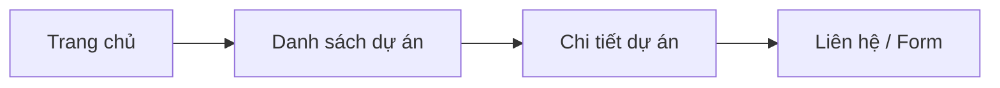

> Minh họa chi tiết: [`minh-hoa-bao-cao-pa2.md` — H1](minh-hoa-bao-cao-pa2.md)

---

### 1.1.3 Đối với nội dung / “hàng hóa” trên website

Không có sản phẩm vật lý hay giao dịch. **“Hàng hóa” = nội dung số:**

| Loại nội dung | Mô tả | Lưu trữ (PA2) | Quản lý qua |
|---------------|--------|----------------|-------------|
| Dự án | Tên, trạng thái, vị trí, mô tả, gallery, bản đồ | PostgreSQL + Cloudinary | Admin → module Dự án |
| Hạng mục dự án | Gallery theo nhóm (Khách sạn, Fancy Tower…) | PostgreSQL + Cloudinary | Admin → Hạng mục con |
| Tin tức | Bài viết, ngày, danh mục, trạng thái duyệt | PostgreSQL + Cloudinary | Admin → module Tin tức |
| Trang tĩnh | Giới thiệu, HR, CTTV | PostgreSQL (JSON blocks) | Admin → Trang tĩnh |
| Banner / media | Ảnh trang chủ, logo | Cloudinary CDN | Admin → Banner |
| Form liên hệ | Yêu cầu tư vấn từ khách | PostgreSQL (`contact_submissions`) | Admin → Liên hệ (read/update) |
| Cài đặt site | Phone, email, địa chỉ | PostgreSQL (`site_settings`) | Super Admin |

**Không cần phân tích sâu:** tồn kho, SKU, giá bán, giỏ hàng, vận chuyển, thanh toán.

---

### 1.1.4 Quá trình sử dụng — hai góc độ

#### A. Khách truy cập (xem nội dung + gửi form)

| Bước | Mô tả |
|------|--------|
| 1 | Truy cập `thienduc.vn` (hoặc `www.thienduc.vn`) |
| 2 | Duyệt 14 trang/route — nội dung lấy từ API + cache ISR |
| 3 | Gửi form liên hệ → **POST API** → lưu PostgreSQL → email thông báo admin → hiển thị “Gửi thành công” |

Khách **không đăng nhập**, không có tài khoản. Luồng form chi tiết: sơ đồ `docs/diagrams/02-form-lien-he.drawio`.

#### B. Người cập nhật nội dung (Admin CMS)

Nhân viên HR/Marketing **tự cập nhật** qua trang quản trị — **không cần developer sửa code**.

**Mô tả dễ hiểu (không chuyên IT):**

> Khi cần đăng dự án mới, tin tức hoặc đổi banner, nhân viên đăng nhập trang quản trị nội bộ, soạn nội dung và tải ảnh lên. Bài viết có thể lưu nháp hoặc gửi cho quản lý duyệt. Sau khi được duyệt và xuất bản, website tự hiển thị nội dung mới cho khách — không cần chờ bộ phận kỹ thuật sửa mã nguồn.

**Luồng kỹ thuật (PA2):**

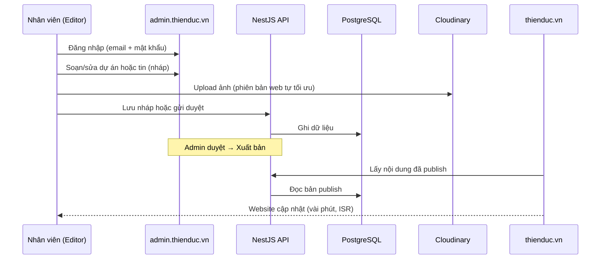

**Quyền hạn theo vai trò:**

| Vai trò | Việc được làm |
|---------|----------------|
| **Editor** | Soạn nháp, upload ảnh, gửi duyệt — **không** tự publish |
| **Admin** | Duyệt bài, publish, xử lý form liên hệ |
| **Super Admin** | Quản lý tài khoản, cài đặt công ty, cấu hình email |

> Minh họa: [`minh-hoa-bao-cao-pa2.md` — H2](minh-hoa-bao-cao-pa2.md) · Form liên hệ: `02-form-lien-he.drawio`

---

### 1.1.5 Đánh giá giao diện website công khai (Frontend)

#### Thành phần giao diện (14 trang)

| Khu vực | Thành phần | Ghi chú |
|---------|------------|---------|
| Header | Logo, menu 7 mục + submenu, tìm kiếm, chuyển Vi/En, top strip liên hệ | Nhất quán mọi trang |
| Trang chủ | Banner slider, 7 lĩnh vực, dự án nổi bật, tin mới, CTA | Nội dung từ API |
| Dự án | Lọc trạng thái, card, chi tiết + gallery + bản đồ + hạng mục | |
| Tin tức | Danh sách + chi tiết bài viết | |
| HR / CTTV | Tuyển dụng, đào tạo, CSNS, sơ đồ TC, công ty thành viên | Quản lý qua trang tĩnh CMS |
| Liên hệ | Form, bản đồ, phone/email/địa chỉ | Form → API → DB |
| Footer | Thông tin công ty, link nhanh | |

#### Điểm mạnh thiết kế

| Tiêu chí | Nhận xét |
|----------|----------|
| Phong cách | Trắng chủ đạo, accent nâu vàng `#B06613` — phù hợp doanh nghiệp xây dựng/BĐS |
| Điều hướng | 14 route rõ ràng; submenu Dự án + Nhân sự |
| Responsive | Mobile / tablet / desktop (Tailwind CSS) |
| Trang dự án | Filter trạng thái, gallery phân hạng mục, bản đồ |
| Thương hiệu | Logo, favicon, màu sắc thống nhất |

#### Yêu cầu bổ sung khi vận hành

| Tiêu chí | Yêu cầu PA2 |
|----------|-------------|
| Song ngữ | Vi/En trên toàn site |
| SEO | Metadata, sitemap, robots, Open Graph, Schema.org |
| Hiệu năng | Ảnh qua Cloudinary CDN; LCP < 2,5s; Lighthouse mobile ≥ 70 |
| 7 lĩnh vực xây dựng | Hiển thị đúng 7 mục nghiệp vụ trên trang chủ |

> Wireframe: [`minh-hoa-bao-cao-pa2.md` — H3](minh-hoa-bao-cao-pa2.md)

---

### 1.1.6 So sánh đối thủ

Phân tích 3 website cùng ngành (xây dựng / BĐS Việt Nam) làm tham chiếu. *Đánh giá dựa trên khảo sát công khai website, không phải benchmark chính thức.*

| Tiêu chí | **Thiên Đức (PA2)** | **Coteccons** | **Đất Xanh Group** | **Novaland** |
|----------|---------------------|---------------|---------------------|--------------|
| Quy mô / vị thế | Doanh nghiệp vừa, TP.HCM + tỉnh | Tập đoàn xây dựng hàng đầu VN | Tập đoàn BĐS lớn | Tập đoàn BĐS top đầu |
| Giao diện | Trắng + nâu vàng, sạch, hiện đại | Corporate chuyên nghiệp | Rich media, slider lớn | Premium |
| Menu / điều hướng | 14 trang, submenu rõ | Đa cấp | Đa cấp, IR + dự án | Đa cấp |
| Trang dự án | Filter + gallery + map + hạng mục | Portfolio lớn | Danh mục đa dạng | Showcase quy mô lớn |
| Form liên hệ | API → DB + email admin | Form + CRM | Form đa kênh | Form + hotline |
| Song ngữ | Vi + En | Vi + En | Vi + En | Vi + En |
| CMS nội dung | Admin CMS 3 cấp quyền | Hệ thống nội bộ | CMS doanh nghiệp | CMS doanh nghiệp |
| Mobile | Responsive | Tốt | Tốt | Tốt |

**Nhận xét:** Thiên Đức PA2 **ngang tầm** website giới thiệu doanh nghiệp vừa — đủ CMS, form, song ngữ. Không cần phức tạp như IR/báo cáo tài chính của tập đoàn lớn.

---

### 1.1.7 Đánh giá kỹ thuật hệ thống (FE + BE + Admin + Database)

#### Stack công nghệ (PA2 hoàn chỉnh)

| Tầng | Công nghệ | Phiên bản | Vai trò |
|------|-----------|-----------|---------|
| **Frontend** | Next.js | 16.x | Website công khai, ISR, SEO |
| | React + TypeScript | 19 / ^5 | UI components |
| | Tailwind CSS | ^4 | Responsive |
| | next-intl | latest | Song ngữ Vi/En |
| **Admin CMS** | Vite + React | latest | Trang quản trị nội dung |
| | shadcn/ui + TanStack Query | — | Form CRUD, data fetching |
| **Backend** | NestJS | latest | REST API, auth, business logic |
| | Prisma | latest | ORM |
| **Database** | PostgreSQL | 15+ | Lưu trữ quan hệ |
| **Media** | Cloudinary | — | CDN ảnh/video |
| **Email** | Gmail SMTP / Workspace | — | Thông báo form liên hệ |
| **Hosting** | Vercel (FE + Admin) + Render/Railway (API + DB) | — | Production |

#### SEO (production)

| Hạng mục | PA2 |
|----------|-----|
| Metadata từng route | ✅ title, description, canonical |
| sitemap.xml + robots.txt | ✅ |
| Open Graph + Twitter Card | ✅ |
| Schema.org (Organization) | ✅ |
| Song ngữ `hreflang` | ✅ Vi + En |

#### Hiệu năng (mục tiêu production)

| Chỉ số | Mục tiêu |
|--------|----------|
| LCP | < 2,5 s |
| CLS | < 0,1 |
| Lighthouse Performance (mobile) | ≥ 70 |
| Ảnh | Cloudinary auto WebP/resize |
| Cache | ISR 60–300 s; CDN edge |

#### Bảo mật

| Hạng mục | PA2 |
|----------|-----|
| HTTPS | SSL tự động (Vercel + Render) |
| Auth admin | JWT + httpOnly cookie |
| Form spam | Rate limit API + captcha (phase 2) |
| Secrets | Biến môi trường — không lộ client |

---

### 1.1.8 Tổng kết hệ thống PA2

| Thành phần | Mô tả | Domain / hosting |
|------------|--------|------------------|
| **Frontend** | 14 trang công khai, song ngữ, SEO | `thienduc.vn` — Vercel |
| **Admin CMS** | CRUD nội dung, upload, duyệt bài, xử lý liên hệ | `admin.thienduc.vn` — Vercel |
| **Backend API** | NestJS REST, auth JWT, email, upload signature | `api.thienduc.vn` — Render/Railway |
| **Database** | PostgreSQL — dự án, tin, form, user, settings | Gộp Render hoặc Neon |
| **Media CDN** | Cloudinary — ảnh dự án, banner, tin tức | cloudinary.com |
| **Staging** | Môi trường UAT trước go-live | `staging.thienduc.vn` |

**Kết luận:** Hệ thống PA2 là **website giới thiệu doanh nghiệp đầy đủ** — khách xem nội dung và gửi form; nhân viên tự quản lý nội dung qua CMS; dữ liệu tập trung trên PostgreSQL; media phân phối qua CDN.

---

## 1.2 Danh sách chức năng

Chức năng chia theo **vai trò**. Khách truy cập **không có** tài khoản, không CRUD — chỉ **xem nội dung công khai** và **gửi form liên hệ** (không liệt kê như quyền quản trị).

### 1.2.1 Chức năng công khai (Website — khách truy cập)

| ID | Chức năng | Mô tả |
|----|-----------|--------|
| P01 | Trang chủ | Banner, giới thiệu, 7 lĩnh vực, dự án nổi bật, tin, CTA |
| P02 | Giới thiệu | Tổng quan, tầm nhìn, sứ mệnh |
| P03 | Danh sách dự án | Lọc trạng thái |
| P04 | Chi tiết dự án | Gallery, map, facts, CTA |
| P05 | Chi tiết hạng mục | Trang con hạng mục trong dự án |
| P06–P07 | Tin tức | List + detail |
| P08–P09 | HR + CTTV | Tuyển dụng, đào tạo, CSNS, sơ đồ TC, CTTV |
| P10 | Liên hệ | Phone, email, map, form |
| P11 | Gửi form | POST API → PostgreSQL + email admin |
| P12 | Song ngữ Vi/En | Locale switcher |
| P13 | SEO | Metadata, sitemap, OG, schema |
| P14 | Responsive | Mobile / tablet / desktop |

---

### 1.2.2 Chức năng quản trị — Editor (Nhân viên nội dung)

| ID | Chức năng | Mô tả | Giai đoạn |
|----|-----------|--------|-----------|
| E01 | Đăng nhập admin | JWT qua API | P0 |
| E02 | Dashboard | Xem liên hệ mới, bài nháp của mình | P0 |
| E03 | CRUD dự án (nháp) | Tạo/sửa/xóa — **không publish** | P1 |
| E04 | CRUD tin tức (nháp) | Soạn bài, gửi duyệt | P1 |
| E05 | Upload ảnh / video | Cloudinary; lưu URL vào CSDL | P1 |
| E06 | Sửa banner trang chủ | Nội dung + ảnh + thứ tự | P1 |
| E07 | Sửa trang tĩnh (nháp) | HR, giới thiệu mở rộng | P2 |
| E08 | **Đặt lịch đăng bài** | Chọn `published_at` tương lai | **Phase 2** *(PA2 cơ bản: publish thủ công; lịch tự động cần cron job)* |

---

### 1.2.3 Chức năng quản trị — Admin

| ID | Chức năng | Mô tả | Giai đoạn |
|----|-----------|--------|-----------|
| A01 | Tất cả quyền Editor | + publish | P1 |
| A02 | Duyệt & publish tin | DRAFT → PENDING → PUBLISHED | P1 |
| A03 | Publish dự án / banner | Hiển thị website | P1 |
| A04 | Quản lý form liên hệ | List, detail, đổi trạng thái, ghi chú nội bộ | P0 |
| A05 | Quản lý trang tĩnh | Publish nội dung HR, CTTV | P2 |
| A06 | Xem báo cáo nhanh | Số liên hệ theo trạng thái, tin chờ duyệt | P0 |

---

### 1.2.4 Chức năng quản trị — Super Admin

| ID | Chức năng | Mô tả | Giai đoạn |
|----|-----------|--------|-----------|
| S01 | Cài đặt site | Phone, email, địa chỉ, metadata global | P2 |
| S02 | Quản lý tài khoản | CRUD user Editor/Admin; khóa/mở | P2 |
| S03 | Phân quyền | SUPER_ADMIN / ADMIN / EDITOR | P2 |
| S04 | Cấu hình email | SMTP Gmail / Workspace | P0 |

**Ghi chú:** Giai đoạn đầu có thể chỉ **1 Super Admin**; mở rộng sau.

---

### 1.2.5 Ánh xạ 14 trang ↔ module CMS

| # | Trang | Route | Module admin |
|---|-------|-------|--------------|
| 1 | Trang chủ | `/` | Banner + Featured |
| 2 | Giới thiệu | `/gioi-thieu` | Trang tĩnh |
| 3 | Dự án | `/du-an` | Dự án |
| 4 | Chi tiết dự án | `/du-an/[slug]` | Dự án |
| 5 | Chi tiết hạng mục | `/du-an/[slug]/[hang-muc]` | Dự án → Hạng mục |
| 6–7 | Tin tức | `/tin-tuc`, `/tin-tuc/[slug]` | Tin tức |
| 8, 10 | Tuyển dụng | `/tuyen-dung` | Trang tĩnh |
| 9 | CTTV | `/cong-ty-thanh-vien` | Trang tĩnh |
| 11–13 | Sơ đồ TC, Đào tạo, CSNS | `/so-do-...`, `/dao-tao`, `/chinh-sach-...` | Trang tĩnh + media |
| 14 | Liên hệ | `/lien-he` | Cài đặt + Form (read) |

---

## 1.3 Sơ đồ hệ thống

> File draw.io: `docs/diagrams/01-dang-nhap.drawio`, `02-form-lien-he.drawio`, `03-upload-anh.drawio`  
> **Lưu ý:** Diagram 02 cần sửa lane Admin từ "Next.js" → **Vite + React**.

### 1.3.1 Sơ đồ tính năng tổng quan

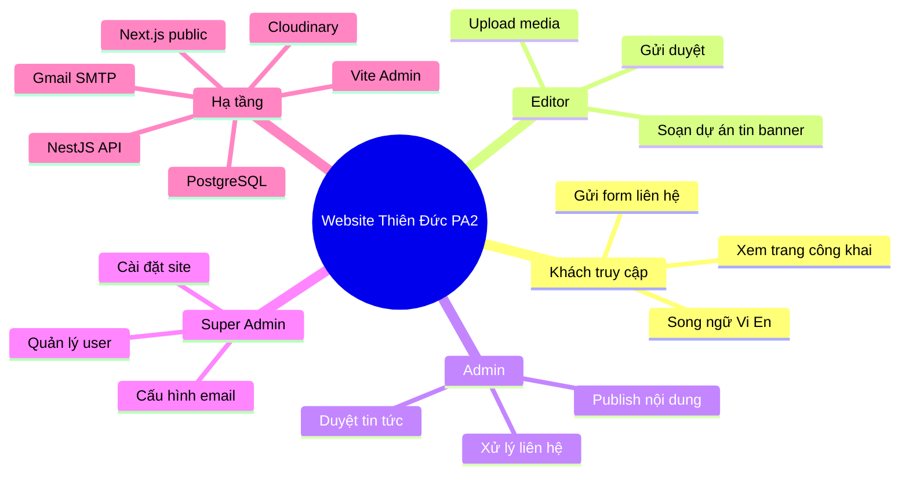

---

### 1.3.2 Sơ đồ kiến trúc tổng thể (3 tầng)

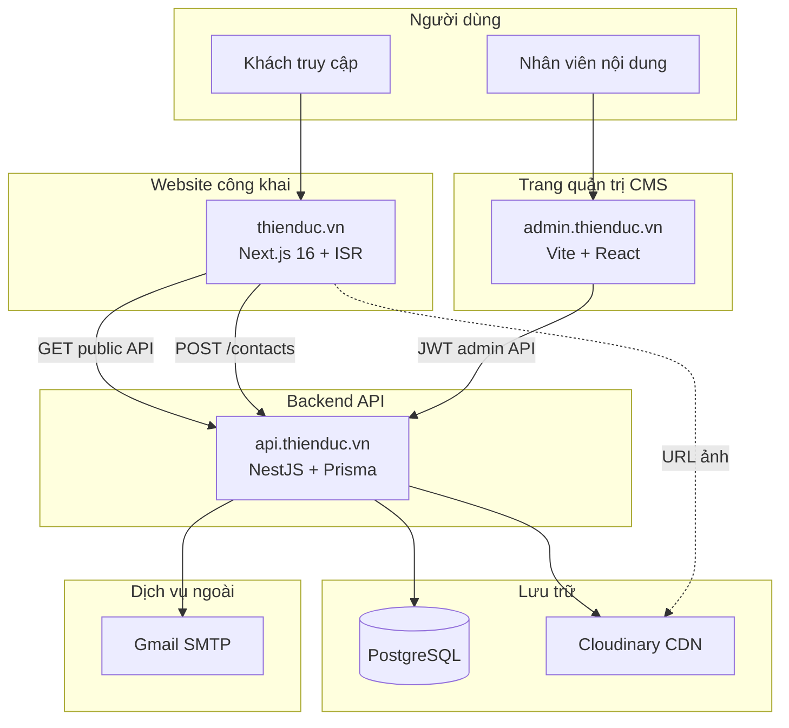

---

### 1.3.3 Sơ đồ luồng dữ liệu — DFD mức 0

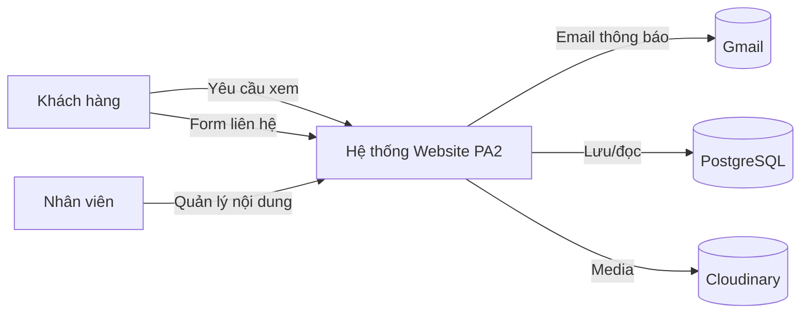

---

### 1.3.4 Sơ đồ luồng dữ liệu — DFD mức 1

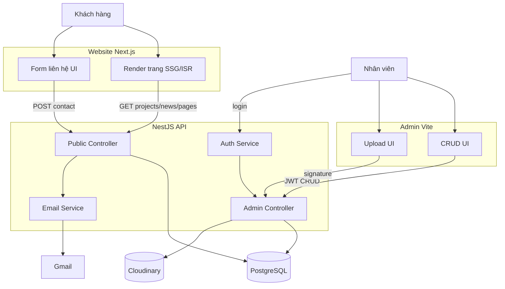

---

### 1.3.5 Sơ đồ cơ sở dữ liệu (ERD)

*Ghi chú:* Trường `scheduled_at` trên `news_posts` phục vụ **đặt lịch đăng bài Phase 2**.

---

### 1.3.6 Sơ đồ chức năng chi tiết

#### (1) Đăng nhập Admin

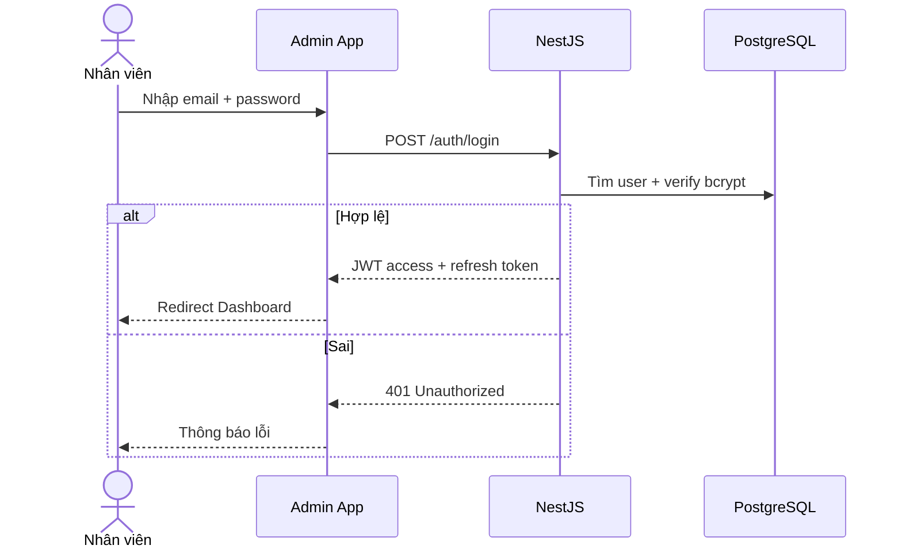

#### (2) Khách gửi form liên hệ

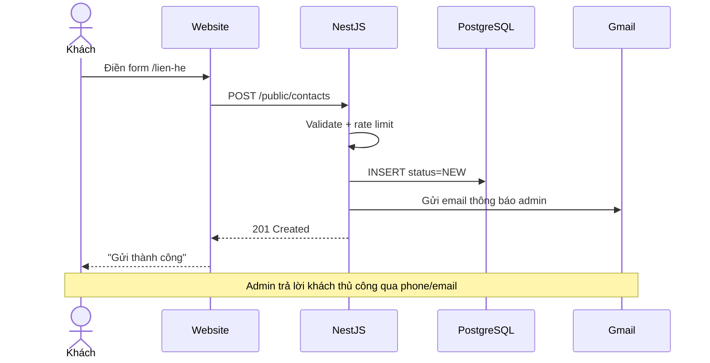

#### (3) Upload ảnh Cloudinary

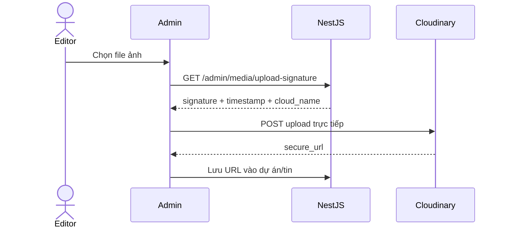

#### (4) Duyệt tin tức

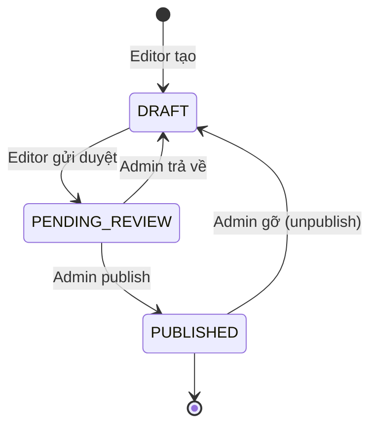

#### (5) Xử lý form liên hệ (Admin)

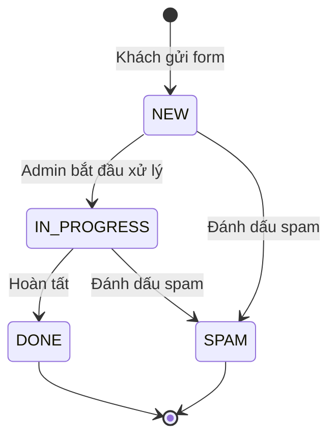

#### (6) Đặt lịch đăng bài (Phase 2)

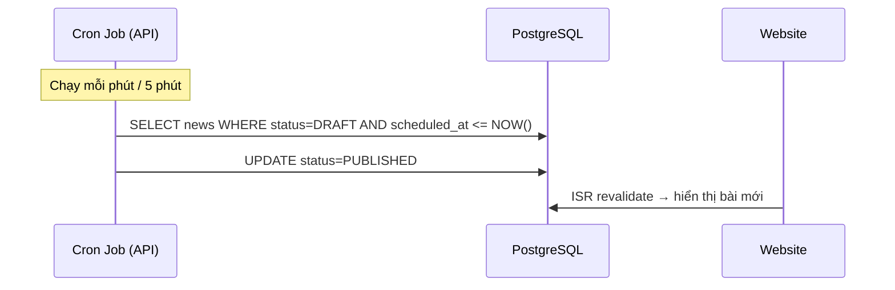

> Export draw.io sang PNG: xem [`minh-hoa-bao-cao-pa2.md` — H7](minh-hoa-bao-cao-pa2.md)

---

# PHẦN 2 — THIẾT KẾ (PHƯƠNG ÁN 2)

## 2.1 Thiết kế Frontend (Website công khai)

### 2.1.1 Yêu cầu giao diện

| Hạng mục | Quy định |
|----------|----------|
| Phong cách | Doanh nghiệp hiện đại, sáng, uy tín — trắng chủ đạo |
| Màu chính | `#B06613` (nâu vàng), `#c99248`, `#fdcd04` (accent) |
| Nền / chữ | `#FFFFFF`, `#F2F2F2`, `#191919`, `#8f8f8f` |
| Logo / favicon | `public/images/brand/` |
| Font hiện tại | Geist Sans (Next.js Google Font) — *xác nhận font chính thức* |
| Responsive | Mobile-first; breakpoint Tailwind 4 |
| Song ngữ | Prefix `/vi/`, `/en/` (đề xuất) |
| Animation | Fade/reveal nhẹ — không block render |

> Wireframe: [`minh-hoa-bao-cao-pa2.md` — H3, H4, H5](minh-hoa-bao-cao-pa2.md)

---

### 2.1.2 Công nghệ Frontend — bảng so sánh và lựa chọn

| Lớp | **Lựa chọn PA2** | Phiên bản | Lý do |
|-----|------------------|-----------|--------|
| Framework | **Next.js** App Router | 16.2.6 | SEO, ISR, codebase ~70% sẵn |
| UI | **React** | 19.2.4 | Chuẩn ecosystem |
| Ngôn ngữ | **TypeScript** | ^5 | Đồng bộ backend |
| CSS | **Tailwind CSS** | ^4 | Responsive nhanh |
| Icon | **lucide-react** | ^1.17 | Nhẹ |
| i18n | **next-intl** *(đề xuất)* | latest | App Router native |
| Lint | **ESLint** | ^9 | Chất lượng mã |

#### So sánh framework frontend

| Tiêu chí | Next.js | Vite + React SPA | WordPress |
|----------|---------|------------------|-----------|
| SEO / SSR | **Rất tốt** | Cần SSR thêm | Tốt |
| Tốc độ phát triển | Tốt (đã có code) | Rất nhanh | Trung bình |
| Phù hợp site công khai | **Có** | Không (dùng cho Admin) | Không tái sử dụng repo |
| Bảo trì lâu dài | **Tốt** | Tốt | Plugin phụ thuộc |
| **Kết luận** | **✅ Chọn** | Admin only | ❌ |

---

### 2.1.3 Chức năng bắt buộc trên giao diện

| Khu vực | Thành phần |
|---------|------------|
| Header | Logo, menu 7 mục, submenu, search, **VI/EN**, CTA |
| Top strip | Địa chỉ (Google Maps), phone (`tel:`), email (`mailto:`) |
| Trang chủ | Banner slider, 7 lĩnh vực, dự án nổi bật, tin, CTA |
| Dự án | Card, filter, gallery, map, link hạng mục |
| Liên hệ | Form 5 trường, bản đồ, validation client |
| Footer | Thông tin công ty, link, social *(nếu có)* |
| SEO | 1 H1/trang, alt ảnh, metadata, OG |

---

### 2.1.4 Hiệu năng tải trang

| Chỉ số | Hiện trạng (local prod) | Mục tiêu go-live |
|--------|-------------------------|------------------|
| TTFB `/` | 204 ms | < 600 ms (CDN VN) |
| TTFB `/lien-he` | 66 ms | < 400 ms |
| HTML size `/` | 95 KB | < 150 KB |
| LCP | *Chưa đo Lighthouse* | < 2,5 s |
| CLS | *Chưa đo* | < 0,1 |
| Lighthouse Perf mobile | *Chưa đo* | ≥ 70 |

**Biện pháp:** `next/image`, WebP, Cloudinary transform, ISR 60–300s, lazy load gallery.

---

## 2.2 Thiết kế Backend + Cơ sở dữ liệu

### 2.2.1 Kiến trúc Backend

| Thành phần | Lựa chọn PA2 |
|------------|--------------|
| Framework | **NestJS** (Node.js + TypeScript) |
| ORM | **Prisma** |
| Database | **PostgreSQL** |
| Auth | JWT (access + refresh) |
| Email | Gmail SMTP / Google Workspace |
| Media | Cloudinary |
| Validation | class-validator + Zod (admin) |
| Rate limit | `@nestjs/throttler` trên POST contact |

---

### 2.2.2 So sánh cơ sở dữ liệu (4 loại)

| Tiêu chí | **PostgreSQL** | MySQL | MongoDB | Redis |
|----------|----------------|-------|---------|-------|
| Quan hệ dự án ↔ hạng mục ↔ gallery | **Rất tốt** (FK, JOIN) | Rất tốt | Trung bình (embed/ref) | ❌ Không |
| Form + trạng thái + role user | **Rất tốt** | Rất tốt | Trung bình | ❌ |
| Workflow duyệt tin (state machine) | **Tốt** (enum + constraint) | Tốt | Linh hoạt nhưng thiếu ACID | ❌ |
| Prisma ORM | **Native hỗ trợ** | Native | Có | Không chính |
| JSON field (trang tĩnh block) | **JSONB mạnh** | JSON | Native | ❌ |
| Full-text search tiếng Việt | Tốt (extension) | Tốt | Tốt | ❌ |
| Backup / restore | **Managed dễ** (Render/Neon) | Tương tự | Atlas | Snapshot |
| Phù hợp quy mô website giới thiệu | **✅ Tối ưu** | ✅ Thay thế | Dư thừa | Chỉ cache |
| Mức tải 100–5000 visit/ngày | **Đủ** | Đủ | Đủ | N/A |
| **Kết luận** | **✅ Chọn PostgreSQL** | Thay thế được | Không ưu tiên | Bổ sung cache Phase 2 |

**Lý do chọn PostgreSQL:** Dữ liệu Thiên Đức **quan hệ rõ** (dự án → hạng mục → ảnh; tin → category; liên hệ → trạng thái); cần **ACID** cho form và workflow duyệt; Prisma + NestJS ecosystem mạnh; hosting managed giá hợp lý.

---

### 2.2.3 So sánh Backend framework

| Tiêu chí | **NestJS** | Laravel (PHP) | Spring Boot (Java) |
|----------|------------|---------------|---------------------|
| Cùng TypeScript với FE | **✅** | ❌ | ❌ |
| Module hóa (auth, CRUD…) | **Tốt** | Tốt | Tốt |
| Tốc độ triển khai PA2 | **Nhanh** | TB | Chậm hơn |
| Learning curve team | Thấp (đã dùng TS) | TB | Cao |
| **Kết luận** | **✅ Chọn** | ❌ | ❌ |

---

### 2.2.4 So sánh lưu trữ media

| Tiêu chí | **Cloudinary** | Lưu VPS/local | AWS S3 |
|----------|----------------|---------------|--------|
| Resize / WebP tự động | **✅** | Thủ công | Thủ công + Lambda |
| CDN global | **✅** | Phụ thuộc host | ✅ |
| Admin upload trực tiếp | **✅ signature** | Phức tạp | Trung bình |
| Chi phí ban đầu | Free tier | Gộp VPS | Pay-as-go |
| **Kết luận** | **✅ Chọn** | ❌ | Thay thế sau |

---

### 2.2.5 API endpoint (tóm tắt)

**Public:** `GET /public/projects`, `/news`, `/pages/:slug`, `/banners`, `/settings/contact` · `POST /public/contacts`

**Admin (JWT):** `/auth/login` · CRUD `/admin/projects`, `/news`, `/pages`, `/banners` · `/admin/contacts` · `/admin/media/upload-signature` · `/admin/users`, `/admin/settings`

*Danh sách endpoint đầy đủ nằm ở mục 2.2.5 trong báo cáo này.*

---

## 2.3 Thiết kế Admin CMS (Vite + React)

| Hạng mục | Lựa chọn |
|----------|----------|
| Framework | Vite + React + TypeScript |
| UI | shadcn/ui + Tailwind CSS |
| Data | TanStack Query |
| Form | React Hook Form + Zod |
| Auth | JWT |
| Deploy | `admin.thienduc.vn` |

> Wireframe Dashboard + Sửa dự án: [`minh-hoa-bao-cao-pa2.md` — H4, H5](minh-hoa-bao-cao-pa2.md)

---

## 2.4 Thiết kế Hosting & hạ tầng

### 2.4.1 So sánh hosting Frontend (website + admin)

| Tiêu chí | **Vercel** | VPS Việt Nam (VD: AZDigi, Viettel IDC) | Shared hosting PHP |
|----------|------------|----------------------------------------|---------------------|
| Tối ưu Next.js | **Rất tốt** | Cần Docker + Node | ❌ Không hỗ trợ |
| Deploy Git push | **✅ Tự động** | Thủ công / CI | Hạn chế |
| SSL | Tự động | Cấu hình Let's Encrypt | Có |
| CDN edge | **Global** | Một region VN | Một server |
| Chi phí/tháng | $0–20 | 200k–800k VND | 50k–150k VND |
| Phù hợp PA2 | **✅ Chọn** | Dự phòng / yêu cầu data in-country | ❌ |
| **Kết luận** | **✅ Frontend + Admin static** | Dự phòng khi cần host VN | ❌ |

---

### 2.4.2 So sánh hosting Backend + Database

| Tiêu chí | **Render / Railway** | VPS VN tự quản | Neon (DB) + VPS API |
|----------|----------------------|----------------|---------------------|
| Deploy NestJS | **1-click Docker** | Linh hoạt | Tách DB |
| PostgreSQL managed | **✅ Gộp** | Tự cài + backup | **✅ Neon free tier** |
| Scale vertical | **Dễ** | Thủ công | TB |
| Chi phí/tháng | $7–25 | 300k–1M VND | $0–15 |
| Monitoring | Có sẵn | Tự cấu hình | TB |
| **Kết luận PA2** | **✅ Chọn** | Scale lớn / compliance VN | Kết hợp được |

---

### 2.4.3 Kiến trúc hosting đề xuất (sơ đồ)

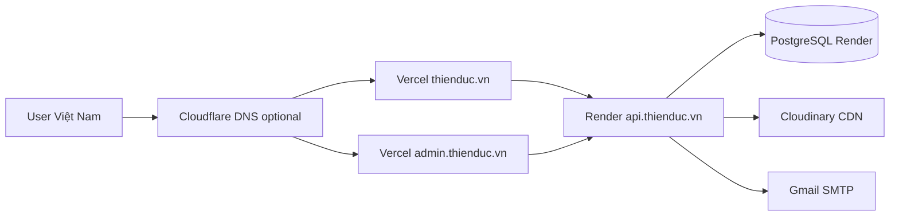

---

### 2.4.4 Domain & subdomain

| Host | Mục đích |
|------|----------|
| `thienduc.vn` | Website công khai |
| `admin.thienduc.vn` | CMS |
| `api.thienduc.vn` | Backend API |
| `staging.thienduc.vn` | UAT |

*Chi phí domain: `docs/so-sanh-domain-trong-nuoc-va-vercel-moi.xlsx`*

---

### 2.4.5 Ước tính chi phí vận hành/tháng

| Hạng mục | Ước tính (VND/tháng) | Ghi chú |
|----------|----------------------|---------|
| Domain `.vn` | ~30k–50k (chia /12) | ~300k–600k/năm |
| Vercel Pro (nếu cần) | ~500k | Free tier có thể đủ giai đoạn đầu |
| Render API + DB | ~350k–600k | $7–25 |
| Cloudinary | 0–600k | Free tier 25GB |
| Gmail Workspace | Theo gói cty | — |
| **Tổng ước tính** | **~400k–1,5 triệu/tháng** | Chưa gồm nhân sự vận hành |

---

# PHẦN 3 — HẠN CHẾ, RỦI RO & KẾ HOẠCH

## 3.1 Hạn chế thiết kế (cụ thể)

| # | Hạn chế | Mô tả chi tiết | Hướng xử lý |
|---|---------|----------------|-------------|
| 1 | **Traffic đồng thời** | PA2 **chưa có load balancing**, single instance API + DB. Ước tính: **~50–100 concurrent users** ổn định trên Render Starter; **>500 concurrent** (VD: viral tin tức, sự kiện lớn) có thể timeout 503. | Scale vertical; thêm Redis cache; CDN static; upgrade plan |
| 2 | **>1000 người truy cập cùng lúc** | Với 1 instance NestJS + PostgreSQL basic, **không đảm bảo** phản hồi <2s cho tất cả. Database connection pool (~10–20) có thể cạn. | Horizontal scaling (PA3): multiple API instances + load balancer + read replica |
| 3 | **Tập trung địa lý** | Deploy US/EU (Vercel/Render): user VN latency +50–150ms so với VPS VN. Một tỉnh/thành truy cập đồng loạt (QC địa phương) **không quá tải CDN** (CDN phân tán), nhưng **API origin** vẫn 1 điểm. | Cloudflare; cân nhắc VPS VN cho API nếu latency là vấn đề |
| 4 | **Ảnh lớn** | Upload không giới hạn dung lượng → LCP chậm | Cloudinary auto-format; giới hạn max 2MB/upload |
| 5 | **Admin đơn giản** | Chưa audit log, chưa lịch đăng tự động (Phase 2), chưa phân quyền từng field. | Mở rộng PA3 |
| 6 | **Backup & DR** | PA2: backup DB daily cơ bản; **RPO ~24h**, **RTO ~2–4h** (restore thủ công) | Cấu hình Render/Neon; test restore hàng quý |
| 7 | **i18n** | Dịch thủ công 2 field (vi/en); không auto-translate | Quy trình nội dung song song |
| 8 | **Gmail SMTP quota** | Free Gmail ~500 email/ngày; form spam có thể vượt | Rate limit 5 req/IP/giờ; Google Workspace; captcha Phase 2 |
| 9 | **Không có WAF** | PA2 chưa Web Application Firewall riêng | Cloudflare free tier; rate limit API |

---

## 3.2 Rủi ro

| Rủi ro | Mức | Giảm thiểu |
|--------|-----|------------|
| Schema DB thay đổi khi triển khai | Thấp | Freeze ERD trước khi code; migration có kiểm soát |
| Nội dung HR/tin chưa đủ go-live | Trung bình | Go-live theo module; placeholder có nhãn |
| Phụ thuộc dịch vụ quốc tế | Trung bình | Phương án VPS VN trong Excel |
| Lighthouse không đạt mục tiêu | Trung bình | Tối ưu ảnh trước UAT |

---

## 3.3 Kế hoạch triển khai (8–10 tuần)

| Tuần | Giai đoạn | Deliverable |
|------|-----------|-------------|
| 1 | Phê duyệt báo cáo v2.0 + freeze ERD | Báo cáo ký, Prisma schema draft |
| 2–3 | Hoàn thiện UI + i18n shell + SEO cơ bản | 14 route, sitemap, robots |
| 4–5 | NestJS + PostgreSQL + public API | POST contact, GET content |
| 6 | Admin P0 | Login, dashboard, liên hệ |
| 7 | Admin P1 | Dự án, tin, banner |
| 8 | Admin P2 | Trang tĩnh, settings, users |
| 9 | Tích hợp FE ↔ API, staging UAT | staging URLs |
| 10 | Go-live production | Domain, SSL, handover |

> Gantt: [`minh-hoa-bao-cao-pa2.md` — H6](minh-hoa-bao-cao-pa2.md)

---

## 3.4 Tiêu chí nghiệm thu

**Website:** 14 route · responsive · Vi/En · form → DB + email · Lighthouse ≥70 · sitemap + robots + OG

**Admin:** login 3 cấp · CRUD dự án/tin/banner/trang tĩnh · workflow duyệt · quản lý liên hệ · Cloudinary

**Kỹ thuật:** staging UAT · backup DB · secrets không lộ client

---

# PHỤ LỤC

## A — Thông tin công ty

| Trường | Giá trị |
|--------|---------|
| Tên | Công ty TNHH ĐT – XD – TM Thiên Đức |
| Thành lập | 2010 |
| Email | dautuxaydungthienduc@yahoo.com |
| Phone | (028) 3740 7188 |
| Địa chỉ | Số 10 Trần Não, Khu Phố 5, Phường An Phú, TP Thủ Đức, TP.HCM |

## B — Màu thương hiệu

| Token | Mã màu |
|-------|--------|
| primary | `#B06613` |
| primarySoft | `#c99248` |
| accent | `#fdcd04` |
| background | `#FFFFFF` |
| surface | `#F2F2F2` |
| text | `#191919` |
| muted | `#8f8f8f` |

## C — 14 trang website (PA2)

| Route | Module CMS | Mô tả |
|-------|------------|--------|
| `/` | Banner + Featured | Trang chủ |
| `/gioi-thieu` | Trang tĩnh | Giới thiệu công ty |
| `/du-an`, `/du-an/[slug]` | Dự án | Danh sách + chi tiết |
| `/du-an/[slug]/[hang-muc]` | Dự án → Hạng mục | Chi tiết hạng mục |
| `/tin-tuc`, `/tin-tuc/[slug]` | Tin tức | Danh sách + chi tiết |
| `/tuyen-dung`, HR pages, `/cong-ty-thanh-vien` | Trang tĩnh | Nhân sự + CTTV |
| `/lien-he` | Cài đặt + Form | Liên hệ |

## D — Checklist minh họa

| ID | Nội dung | Trạng thái |
|----|----------|------------|
| H01 | Sơ đồ 3 tầng PA2 (Mermaid 1.3.2) | ✅ Trong báo cáo |
| H02 | Flow khách (Mermaid 1.1.2) | ✅ |
| H03 | Flow cập nhật nội dung CMS (1.1.4 + minh-hoa H2) | ✅ |
| H04 | Wireframe trang chủ | ✅ `minh-hoa-bao-cao-pa2.md` |
| H05 | Wireframe admin | ✅ `minh-hoa-bao-cao-pa2.md` |
| H06 | ERD (Mermaid 1.3.5) | ✅ |
| H07 | 6 sequence/state diagrams (1.3.6) | ✅ |
| H08 | Gantt 8–10 tuần | ✅ `minh-hoa-bao-cao-pa2.md` |
| H09 | Screenshot UI thật (4 màn hình) | ☐ Chụp thủ công |
| H10 | Lighthouse screenshot | ☐ Chrome DevTools |
| H11 | Export draw.io 01–03 PNG | ☐ Export thủ công |
| H12 | Screenshot đối thủ 2–3 site | ☐ Chụp thủ công |

## E — Lý do chọn PA2

| So với | PA1 | **PA2** | PA3 |
|--------|-----|---------|-----|
| Thời gian | Nhanh nhất | Trung bình | Lâu nhất |
| Admin tách + CMS | Hạn chế | **✅ Đầy đủ** | Đầy đủ |
| Phân quyền | Cơ bản | **3 cấp** | Chi tiết |
| Form + DB + email | Một phần | **✅** | ✅ |
| Phù hợp Thiên Đức | Tạm | **✅ Nhất** | Chưa cần |

---

## Kết luận và đề nghị

1. **Chấp nhận** Phương án 2 — hệ thống đầy đủ FE + BE + Admin + Database.
2. **Phê duyệt** báo cáo v2.1 (phân tích hệ thống hoàn chỉnh + thiết kế + sơ đồ + hạn chế).
3. **Triển khai** theo timeline 8–10 tuần (mục 3.3).
4. **Bổ sung** screenshot UI + Lighthouse trước trình ký final (Phụ lục D).

---

**Người lập báo cáo:** _________________________  
**Ngày:** _________________________  
**Người phê duyệt:** _________________________  
**Ngày phê duyệt:** _________________________  

---

*Tài liệu Markdown làm việc — xuất Word/PDF để trình ký. Minh họa: [`minh-hoa-bao-cao-pa2.md`](minh-hoa-bao-cao-pa2.md)*
