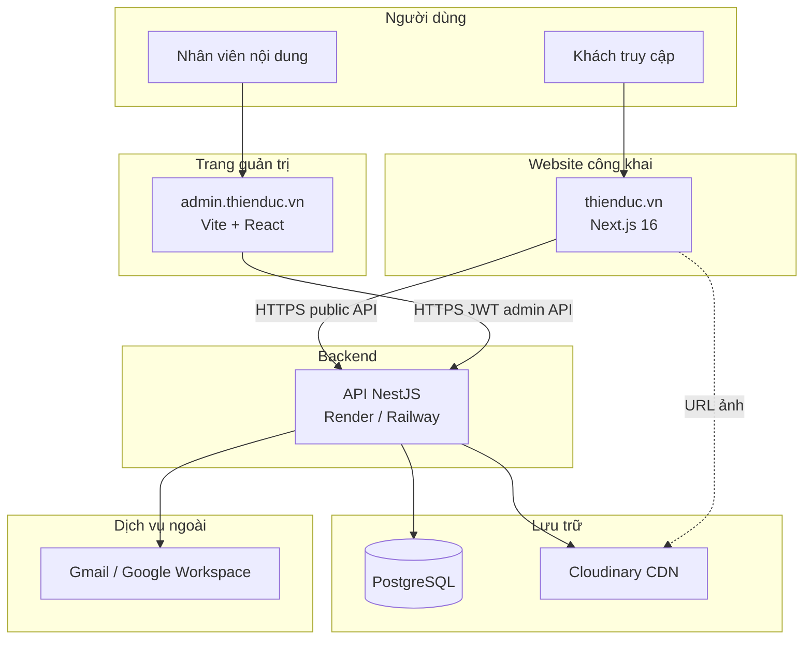
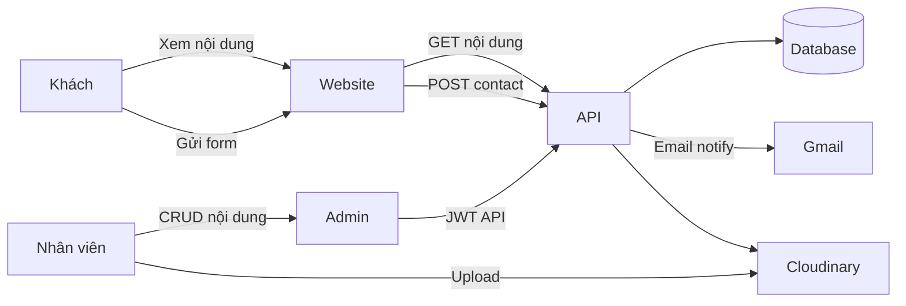
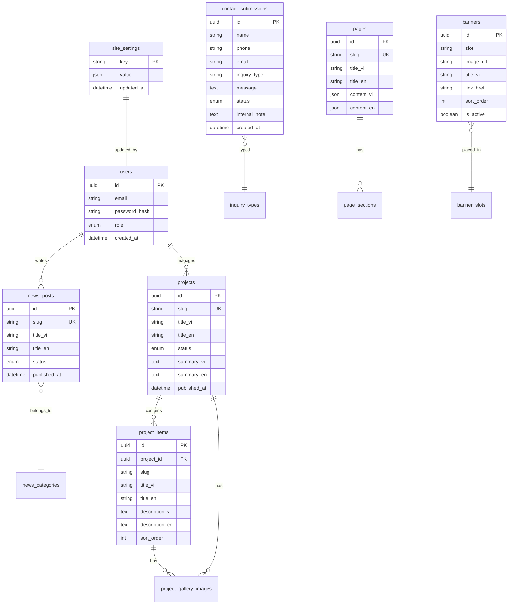

# BÁO CÁO PHƯƠNG ÁN 2 — WEBSITE GIỚI THIỆU CÔNG TY THIÊN ĐỨC

| Thông tin | Nội dung |
|-----------|----------|
| **Dự án** | Website giới thiệu Công ty TNHH ĐT – XD – TM Thiên Đức |
| **Phương án** | Phương án 2 — Cân bằng giữa thời gian, chi phí và khả năng mở rộng |
| **Phiên bản tài liệu** | 1.0 |
| **Ngày lập** | 12/06/2026 |
| **Trạng thái** | Bản nháp trình phê duyệt triển khai |
| **Tài liệu tham chiếu** | `Bao-cao-phuong-an-ky-thuat-website-Thien-Duc.doc`, `Bao-cao-trien-khai-chi-tiet-phuong-an-2.doc`, `THIENDUC_DOCUMENT.txt` |

---

## Tóm tắt điều hành

Website Thiên Đức là **trang giới thiệu doanh nghiệp** (corporate / landing), không phải website thương mại điện tử. Mục tiêu chính: xây dựng uy tín thương hiệu, giới thiệu dự án/sản phẩm, hỗ trợ tư vấn qua form liên hệ, và phục vụ tuyển dụng.

**Phương án 2** được lựa chọn vì tách rõ ba tầng: website công khai (Next.js), trang quản trị nội dung (Vite + React), và backend xử lý dữ liệu (NestJS + PostgreSQL). Nhân viên không biết lập trình có thể cập nhật nội dung qua admin mà không cần sửa mã nguồn.

**Hiện trạng triển khai:** Đội phát triển đã xây dựng trước **~70% giao diện website** trên Next.js với dữ liệu tĩnh trong `src/data/`. Backend, admin CMS và song ngữ Vi/En **chưa triển khai**. Báo cáo này là cơ sở để **dừng mở rộng code tạm thời**, hoàn thiện phân tích — thiết kế — phê duyệt trước khi triển khai tiếp.

**Thời gian ước lượng toàn dự án PA2:** 8–10 tuần (website + API + admin + tích hợp + UAT + go-live).

> **[HÌNH ẢNH CẦN BỔ SUNG]** Sơ đồ tổng quan 3 tầng PA2 (1 trang) — vẽ theo mục 1.3.1.

---

# PHẦN 1 — PHÂN TÍCH HỆ THỐNG

## 1.1 Khảo sát hiện trạng

### 1.1.1 Bối cảnh dự án

Công ty Thiên Đức hoạt động trong lĩnh vực đầu tư, xây dựng và phát triển bất động sự / dự án đô thị. Website phục vụ:

- **Khách hàng / nhà đầu tư:** tìm hiểu công ty, dự án, liên hệ tư vấn.
- **Ứng viên / nhân sự:** xem thông tin tuyển dụng, chính sách HR.
- **Nội bộ (sau PA2):** cập nhật dự án, tin tức, banner, xử lý yêu cầu liên hệ qua trang admin.

Website **không** có: giỏ hàng, đặt hàng, thanh toán trực tuyến, tài khoản khách hàng.

---

### 1.1.2 Đối với khách hàng — họ vào website làm gì?

| Nhu cầu | Hành vi mong đợi | Route liên quan |
|---------|------------------|-----------------|
| Tìm hiểu công ty | Đọc giới thiệu, tầm nhìn, lĩnh vực | `/`, `/gioi-thieu` |
| Xem dự án/sản phẩm | Lọc theo trạng thái, xem chi tiết, gallery | `/du-an`, `/du-an/[slug]` |
| Xem hạng mục trong dự án | Xem chi tiết từng hạng mục (VD: khách sạn, căn hộ) | `/du-an/[slug]/[hang-muc]` *(yêu cầu nghiệp vụ; chưa có route riêng)* |
| Đọc tin tức | Danh sách + chi tiết bài viết | `/tin-tuc`, `/tin-tuc/[slug]` |
| Tuyển dụng / HR | Xem vị trí, chính sách, sơ đồ tổ chức | `/tuyen-dung`, `/dao-tao`, … |
| Liên hệ / tư vấn | Gọi điện, email, bản đồ, gửi form | `/lien-he` |
| Đổi ngôn ngữ | Vi ↔ En | *(yêu cầu nghiệp vụ; chưa triển khai)* |

**Luồng khách hàng điển hình (rút gọn):**

```
Vào trang chủ → Xem dự án nổi bật → Chi tiết dự án → CTA "Liên hệ tư vấn"
                                                      ↓
                                            Điền form /lien-he
```

> **[HÌNH ẢNH CẦN BỔ SUNG]** Screenshot luồng: Trang chủ → Danh sách dự án → Chi tiết dự án → Liên hệ (4 ảnh ghép hoặc 1 flow diagram).

---

### 1.1.3 Đối với nội dung / “hàng hóa” trên website

Website Thiên Đức **không bán hàng**. “Sản phẩm” trên site là **nội dung số**:

| Loại nội dung | Mô tả | Nguồn hiện tại |
|---------------|--------|----------------|
| Dự án | Tên, trạng thái, vị trí, mô tả, gallery, bản đồ | `src/data/projects.ts` |
| Hạng mục dự án | Nhóm gallery theo hạng mục (VD: Khách sạn, Fancy Tower) | `gallerySections` trong data dự án |
| Tin tức | Bài viết, ngày đăng, danh mục | `src/data/news.ts` |
| Trang tĩnh | Giới thiệu, HR, công ty thành viên | `src/data/about.ts`, các page placeholder |
| Banner / media | Ảnh trang chủ, logo, favicon | `public/images/` |
| Thông tin liên hệ | Phone, email, địa chỉ | `src/config/site.ts` |

**Không cần phân tích sâu:** tồn kho, SKU, giá bán, giỏ hàng, vận chuyển.

---

### 1.1.4 Quá trình sử dụng — hai góc độ

#### A. Khách truy cập (đơn giản — chỉ xem và gửi form)

| Bước | Mô tả | Hiện trạng |
|------|--------|------------|
| 1 | Truy cập website | Chạy local / chưa production |
| 2 | Duyệt menu, xem nội dung | Header/footer thống nhất, 12 route |
| 3 | Gửi form liên hệ | Mở ứng dụng email (`mailto:`) — **chưa lưu DB, chưa Gmail backend** |

#### B. Người cập nhật nội dung

**Hiện trạng (trước PA2):**

```
Nhu cầu thay đổi nội dung
        ↓
Yêu cầu developer
        ↓
Sửa file TypeScript/JSON trong src/data/
        ↓
Commit → build → deploy thủ công
```

**Hạn chế:** Nhân viên marketing/HR **không thể tự cập nhật**; mọi thay đổi phụ thuộc dev.

**Quy trình mục tiêu (PA2 — sau triển khai admin):**

```
Đăng nhập admin.thienduc.vn
        ↓
Dashboard (liên hệ mới, bài nháp)
        ↓
┌─────────────────┬──────────────────┬─────────────────┐
│ Sửa dự án/tin   │ Upload ảnh       │ Xử lý form      │
│ banner/trang    │ (Cloudinary)     │ liên hệ         │
└─────────────────┴──────────────────┴─────────────────┘
        ↓
Publish / duyệt (Admin)
        ↓
Website tự cập nhật qua API (ISR)
```

> **[HÌNH ẢNH CẦN BỔ SUNG]** So sánh 2 flow trên (hiện trạng vs PA2) — 1 sơ đồ swimlane.

---

### 1.1.5 Đánh giá giao diện và điều hướng (hiện trạng codebase)

#### Điểm mạnh

| Tiêu chí | Nhận xét |
|----------|----------|
| Phong cách | Trắng chủ đạo, accent nâu vàng `#B06613` — phù hợp doanh nghiệp xây dựng/BĐS |
| Cấu trúc menu | Rõ ràng: Trang chủ, Giới thiệu, Dự án (submenu), Tin tức, CTTV, Nhân sự, Liên hệ |
| Layout | `SiteShell` — header/footer nhất quán mọi trang |
| Trang dự án | Filter `?status=`, trang chi tiết có gallery, map, quick facts |
| Responsive | Tailwind CSS — layout co giãn mobile/tablet/desktop |

#### Điểm cần cải thiện

| Tiêu chí | Nhận xét |
|----------|----------|
| Trang placeholder | Tuyển dụng, đào tạo, chính sách NS, CTTV, sơ đồ TC — nội dung mỏng |
| Song ngữ | Chưa có language switcher |
| Chi tiết hạng mục | Chưa có URL riêng `/du-an/[slug]/[hang-muc]` |
| Form liên hệ | Chưa production-ready (mailto) |
| 7 lĩnh vực xây dựng | Data hiện gom theo ngành nghề ĐKKD, chưa khớp 7 mục yêu cầu nghiệp vụ |

> **[HÌNH ẢNH CẦN BỔ SUNG]**
> - H1: Screenshot trang chủ (desktop)
> - H2: Screenshot menu mobile
> - H3: Screenshot trang chi tiết dự án Hưng Phú
> - H4: Screenshot trang liên hệ

---

### 1.1.6 So sánh đối thủ (khung đánh giá)

> **Ghi chú:** Cần chọn 2–3 website cùng ngành (BĐS / xây dựng VN) và điền bảng dưới.

| Tiêu chí | Thiên Đức (hiện tại) | Đối thủ A: _______ | Đối thủ B: _______ |
|----------|----------------------|---------------------|---------------------|
| Giao diện hiện đại | Trắng + nâu vàng, sạch | *[điền]* | *[điền]* |
| Menu / điều hướng | 12 route, submenu dự án | *[điền]* | *[điền]* |
| Trang dự án | Có filter + gallery | *[điền]* | *[điền]* |
| Form liên hệ | mailto (tạm) | *[điền]* | *[điền]* |
| Song ngữ | Chưa có | *[điền]* | *[điền]* |
| Tốc độ / mobile | *[chạy Lighthouse — mục 1.1.7]* | *[điền]* | *[điền]* |

> **[HÌNH ẢNH CẦN BỔ SUNG]** Screenshot homepage 2–3 đối thủ (chú thích tên công ty).

---

### 1.1.7 Đánh giá kỹ thuật hiện trạng

#### Stack frontend hiện có

| Công nghệ | Phiên bản |
|-----------|-----------|
| Next.js | 16.2.6 |
| React | 19.2.4 |
| TypeScript | ^5 |
| Tailwind CSS | ^4 |
| lucide-react | ^1.17.0 |
| ESLint | ^9 |

#### SEO

| Hạng mục | Hiện trạng |
|----------|------------|
| Metadata từng route | Có (`title`, `description`) |
| `metadataBase` | Có trong layout |
| Sitemap / robots.txt | *[cần kiểm tra và bổ sung nếu thiếu]* |
| Open Graph / Schema.org | *[cần bổ sung cho production]* |
| Tiếng Việt có dấu | Đã chuẩn hóa phần lớn |

#### Hiệu năng (Lighthouse)

> **Chưa đo trong báo cáo này.** Cần chạy trên bản build production và điền bảng:

| Trang | Performance | Accessibility | Best Practices | SEO |
|-------|-------------|---------------|----------------|-----|
| `/` | *[điền]* | *[điền]* | *[điền]* | *[điền]* |
| `/du-an` | *[điền]* | *[điền]* | *[điền]* | *[điền]* |
| `/lien-he` | *[điền]* | *[điền]* | *[điền]* | *[điền]* |

**Cách đo:** `npm run build` → `npm run start` → Chrome DevTools → Lighthouse (Mobile + Desktop).

**Rủi ro hiện tại:** Thư mục `public/images` chứa ảnh dự án dung lượng lớn — có thể ảnh hưởng Performance nếu chưa tối ưu.

> **[HÌNH ẢNH CẦN BỔ SUNG]** Screenshot kết quả Lighthouse trang chủ (mobile + desktop).

#### Build & chất lượng mã

| Kiểm tra | Kết quả (theo ghi nhận 06/2026) |
|----------|----------------------------------|
| `npm run lint` | PASS |
| `npm run build` | PASS |

---

### 1.1.8 Tổng kết hiện trạng

| Khía cạnh | Mức hoàn thiện | Ghi chú |
|-----------|----------------|---------|
| UI website công khai | ~70% | Home, Giới thiệu, Dự án, Tin tức, Liên hệ khá đầy đủ |
| Nội dung HR / phụ | ~20% | Placeholder |
| Backend API | 0% | Chưa có |
| Admin CMS | 0% | Chưa có |
| Song ngữ Vi/En | 0% | Chưa có |
| Form liên hệ production | 0% | mailto tạm |
| CMS / tự cập nhật nội dung | 0% | Data tĩnh trong repo |

**Kết luận phân tích:** Việc code frontend trước đã tạo **mẫu trực quan hữu ích** cho phê duyệt giao diện, nhưng **chưa có hồ sơ phân tích — thiết kế hoàn chỉnh** trước khi triển khai backend/CMS. Báo cáo này khắc phục khoảng trống đó.

---

## 1.2 Danh sách chức năng

Chức năng được chia theo **đối tượng sử dụng**. Website Thiên Đức **không có chức năng đăng ký/đăng nhập cho khách**.

### 1.2.1 Chức năng công khai (Khách truy cập)

| ID | Chức năng | Mô tả | MVP |
|----|-----------|--------|-----|
| P01 | Xem trang chủ | Banner, giới thiệu ngắn, dự án nổi bật, tin mới, CTA | ✓ |
| P02 | Xem giới thiệu công ty | Tổng quan, tầm nhìn, sứ mệnh, lĩnh vực | ✓ |
| P03 | Danh sách dự án | Lọc: đã bàn giao / đang thi công / chuẩn bị K/C | ✓ |
| P04 | Chi tiết dự án | Mô tả, facts, gallery, bản đồ, CTA | ✓ |
| P05 | Chi tiết hạng mục dự án | Trang con từng hạng mục trong dự án | ✓ (bổ sung) |
| P06 | Danh sách tin tức | Sắp xếp theo ngày | ✓ |
| P07 | Chi tiết tin tức | Nội dung đầy đủ | ✓ |
| P08 | Trang HR | Tuyển dụng, đào tạo, chính sách NS, sơ đồ TC | ✓ |
| P09 | Công ty thành viên | Danh sách / mô tả CTTV | ✓ |
| P10 | Liên hệ | Phone, email, địa chỉ, bản đồ, form | ✓ |
| P11 | Gửi form liên hệ | POST API → lưu DB + email admin | ✓ (PA2) |
| P12 | Song ngữ Vi/En | Chuyển locale, nội dung 2 ngôn ngữ | ✓ (PA2) |
| P13 | SEO | Metadata, sitemap, OG | ✓ |
| P14 | Responsive | Mobile / tablet / desktop | ✓ |

**Ngoài phạm vi (OUT):** Giỏ hàng, thanh toán, đăng ký tài khoản khách, chat bot (phase sau nếu cần).

---

### 1.2.2 Chức năng quản trị — Editor

| ID | Chức năng | Mô tả |
|----|-----------|--------|
| E01 | Đăng nhập admin | JWT qua API |
| E02 | Xem dashboard | Liên hệ mới, bài nháp |
| E03 | Tạo/sửa dự án (nháp) | CRUD, gallery, không publish |
| E04 | Tạo/sửa tin tức (nháp) | Gửi duyệt, không publish trực tiếp |
| E05 | Upload ảnh | Cloudinary |
| E06 | Sửa banner | Nội dung + ảnh trang chủ |

---

### 1.2.3 Chức năng quản trị — Admin

| ID | Chức năng | Mô tả |
|----|-----------|--------|
| A01 | Tất cả quyền Editor | + publish |
| A02 | Duyệt & publish tin tức | DRAFT → PENDING → PUBLISHED |
| A03 | Publish dự án / banner | Hiển thị website |
| A04 | Quản lý form liên hệ | Xem danh sách, chi tiết, đổi trạng thái, ghi chú |
| A05 | Quản lý trang tĩnh | HR, giới thiệu mở rộng |

---

### 1.2.4 Chức năng quản trị — Super Admin

| ID | Chức năng | Mô tả |
|----|-----------|--------|
| S01 | Cài đặt site | Phone, email, địa chỉ, metadata global |
| S02 | Quản lý tài khoản | Tạo/sửa/khóa user Editor/Admin |
| S03 | Phân quyền | SUPER_ADMIN / ADMIN / EDITOR |

**Ghi chú:** Hiện tại có thể chỉ cần **1 tài khoản Super Admin**; mở rộng sau.

---

### 1.2.5 Ánh xạ 14 trang nghiệp vụ ↔ module CMS

| # | Trang | Route | Module admin | Ghi chú |
|---|-------|-------|--------------|---------|
| 1 | Trang chủ | `/` | Banner + Featured | Ghép nhiều nguồn |
| 2 | Giới thiệu | `/gioi-thieu` | Trang tĩnh / About | |
| 3 | Dự án | `/du-an` | Dự án (list) | |
| 4 | Chi tiết dự án | `/du-an/[slug]` | Dự án (detail) | |
| 5 | Chi tiết hạng mục | `/du-an/[slug]/[hang-muc]` | Dự án → Hạng mục | **Bổ sung** |
| 6 | Tin tức | `/tin-tuc` | Tin tức | |
| 7 | Chi tiết tin | `/tin-tuc/[slug]` | Tin tức | |
| 8 | Tuyển dụng | `/tuyen-dung` | Trang tĩnh | |
| 9 | Công ty thành viên | `/cong-ty-thanh-vien` | Trang tĩnh | |
| 10 | Tuyển dụng NS *(menu Nhân sự)* | `/tuyen-dung` | Cùng mục 8 | Xác nhận 1 trang |
| 11 | Sơ đồ tổ chức | `/so-do-to-chuc-cong-ty` | Trang tĩnh + media | |
| 12 | Đào tạo | `/dao-tao` | Trang tĩnh | |
| 13 | Chính sách nhân sự | `/chinh-sach-nhan-su` | Trang tĩnh | |
| 14 | Liên hệ | `/lien-he` | Cài đặt + Form (read-only) | |

---

## 1.3 Sơ đồ hệ thống

> Các file draw.io có sẵn: `docs/diagrams/01-dang-nhap.drawio`, `02-form-lien-he.drawio`, `03-upload-anh.drawio`.  
> **Lưu ý:** Diagram 02 cần cập nhật lane Admin từ "Next.js" sang **Vite + React** (admin tách riêng).

### 1.3.1 Sơ đồ tổng quan hệ thống (Phương án 2)



> **[HÌNH ẢNH CẦN BỔ SUNG]** Xuất sơ đồ trên sang PNG (draw.io / Mermaid export) — đính Phụ lục A.

---

### 1.3.2 Sơ đồ luồng dữ liệu (DFD — mức 0)



---

### 1.3.3 Sơ đồ cơ sở dữ liệu (ERD — đề xuất)



> **Ghi chú:** ERD trên là **đề xuất thiết kế** cho PA2. Chưa triển khai trong code. Cần review với team trước khi migrate Prisma.

---

### 1.3.4 Sơ đồ chức năng — các luồng bắt buộc

| # | Luồng | Mô tả | Tài liệu tham chiếu |
|---|-------|--------|---------------------|
| 1 | Đăng nhập admin | POST /auth/login → JWT | `diagrams/01-dang-nhap.drawio` |
| 2 | Khách gửi form | Validate → DB → email → thông báo UI | `diagrams/02-form-lien-he.drawio` |
| 3 | Upload ảnh | Signature → Cloudinary → lưu URL | `diagrams/03-upload-anh.drawio` |
| 4 | Duyệt tin tức | DRAFT → PENDING_REVIEW → PUBLISHED | *[vẽ thêm]* |
| 5 | Xử lý liên hệ | NEW → IN_PROGRESS → DONE / SPAM | *[vẽ thêm]* |

> **[HÌNH ẢNH CẦN BỔ SUNG]** Export 5 sơ đồ trên từ draw.io (PNG) — Phụ lục B.

---

# PHẦN 2 — THIẾT KẾ (PHƯƠNG ÁN 2)

## 2.1 Thiết kế Frontend (Website công khai)

### 2.1.1 Yêu cầu giao diện

| Hạng mục | Quy định |
|----------|----------|
| Phong cách | Doanh nghiệp hiện đại, sáng, uy tín |
| Tông màu chủ đạo | Trắng `#FFFFFF`, xám `#F2F2F2`, chữ `#191919` |
| Màu accent | Nâu vàng `#B06613`, accent phụ `#fdcd04` |
| Logo / favicon | `public/images/brand/` |
| Font | Geist Sans (hiện tại qua Next.js) — *[xác nhận font chính thức từ công ty]* |
| Responsive | Mobile-first; breakpoint Tailwind mặc định |
| Song ngữ | Prefix `/vi/...`, `/en/...` hoặc query — *[chốt khi triển khai i18n]* |
| Animation | Nhẹ (fade/reveal) — không làm chậm trang |

> **[HÌNH ẢNH CẦN BỔ SUNG]**
> - Brand guideline (logo, màu, font) nếu có file PDF từ công ty
> - Moodboard 3–4 screenshot trang hiện tại

---

### 2.1.2 Công nghệ Frontend — bảng lựa chọn

| Lớp | Lựa chọn PA2 | Phiên bản | Lý do |
|-----|--------------|-----------|--------|
| Framework | **Next.js** (App Router) | 16.2.6 | SEO, SSR/ISR, repo đã có |
| UI library | **React** | 19.2.4 | Chuẩn ecosystem |
| Ngôn ngữ | **TypeScript** | ^5 | Type-safe, đồng bộ backend |
| CSS | **Tailwind CSS** | ^4 | Tốc độ dev, responsive |
| Icon | **lucide-react** | ^1.17 | Nhẹ, nhất quán |
| i18n | **next-intl** *(đề xuất)* | — | Phổ biến với Next.js App Router |

#### So sánh framework frontend (rút gọn)

| Tiêu chí | Next.js | Vite + React SPA | WordPress |
|----------|---------|------------------|-------------|
| SEO | Tốt (SSR/ISR) | Cần thêm cấu hình | Tốt |
| Tốc độ dev | Tốt | Rất nhanh | Trung bình |
| Phù hợp PA2 | **Có — đã có codebase** | Admin dùng, không phải site chính | Không tái sử dụng repo |
| **Kết luận** | **Chọn Next.js** | Dùng cho Admin | Không chọn |

---

### 2.1.3 Chức năng bắt buộc trên giao diện

| Khu vực | Thành phần |
|---------|------------|
| Header | Logo, menu, CTA liên hệ, language switcher (PA2) |
| Footer | Thông tin công ty, link nhanh, phone/email |
| Trang chủ | Banner slider, lĩnh vực (7 mục), dự án nổi bật, tin mới, CTA |
| Dự án | Card, filter trạng thái, gallery, map |
| Liên hệ | Form, bản đồ, kênh liên lạc |
| SEO | H1 duy nhất/trang, alt ảnh, metadata |

---

### 2.1.4 Hiệu năng tải trang

| Chỉ số mục tiêu (production) | Ngưỡng đề xuất |
|------------------------------|----------------|
| LCP | < 2.5s |
| CLS | < 0.1 |
| Lighthouse Performance (mobile) | ≥ 70 *(mục tiêu ban đầu)* |

**Biện pháp:** `next/image`, tối ưu ảnh, ISR, Cloudinary CDN.

> **[HÌNH ẢNH CẦN BỔ SUNG]** Bảng Lighthouse sau khi đo (mục 1.1.7).

---

## 2.2 Thiết kế Backend + Cơ sở dữ liệu

### 2.2.1 Kiến trúc Backend

| Thành phần | Lựa chọn PA2 |
|------------|--------------|
| Framework | **NestJS** (Node.js + TypeScript) |
| ORM | **Prisma** |
| Database | **PostgreSQL** |
| Auth | JWT (+ httpOnly cookie — chốt khi implement) |
| Email | Gmail SMTP / Google Workspace |
| Media | Cloudinary (upload signature từ API) |

---

### 2.2.2 So sánh cơ sở dữ liệu

| Tiêu chí | PostgreSQL | MySQL | MongoDB | Redis |
|----------|------------|-------|---------|-------|
| Quan hệ dự án ↔ hạng mục ↔ tin | **Tốt** | Tốt | Trung bình | Không |
| Form + trạng thái + user role | **Tốt** | Tốt | Trung bình | Không |
| Prisma hỗ trợ | **Tốt** | Tốt | Có | Không chính |
| Phù hợp quy mô website giới thiệu | **Tốt** | Tốt | Dư thừa schema linh hoạt | Chỉ cache |
| **Kết luận** | **Chọn** | Thay thế được | Không ưu tiên | Bổ sung cache sau |

---

### 2.2.3 So sánh Backend framework

| Tiêu chí | NestJS | Laravel (PHP) | Spring Boot (Java) |
|----------|--------|---------------|---------------------|
| Cùng ngôn ngữ TS với frontend | **Có** | Không | Không |
| Module hóa (auth, contacts, …) | **Tốt** | Tốt | Tốt |
| Tốc độ triển khai PA2 | **Nhanh** | Trung bình | Chậm hơn |
| Doc PA2 đã chọn | **Có** | — | — |
| **Kết luận** | **Chọn** | Không | Không |

---

### 2.2.4 API — danh sách endpoint đề xuất

#### Public (website — không cần đăng nhập)

| Method | Endpoint | Mô tả |
|--------|----------|--------|
| GET | `/public/projects` | Danh sách dự án (filter status, locale) |
| GET | `/public/projects/:slug` | Chi tiết dự án |
| GET | `/public/projects/:slug/items/:itemSlug` | Chi tiết hạng mục |
| GET | `/public/news` | Danh sách tin |
| GET | `/public/news/:slug` | Chi tiết tin |
| GET | `/public/pages/:slug` | Trang tĩnh |
| GET | `/public/banners` | Banner trang chủ |
| GET | `/public/settings/contact` | Phone, email, địa chỉ |
| POST | `/public/contacts` | Gửi form liên hệ |

#### Admin (JWT required)

| Method | Endpoint | Mô tả |
|--------|----------|--------|
| POST | `/auth/login` | Đăng nhập |
| GET | `/admin/contacts` | Danh sách liên hệ |
| PATCH | `/admin/contacts/:id` | Cập nhật trạng thái / ghi chú |
| GET/POST/PATCH | `/admin/projects` | CRUD dự án |
| GET/POST/PATCH | `/admin/news` | CRUD tin tức |
| GET/PATCH | `/admin/pages/:slug` | Trang tĩnh |
| GET/PATCH | `/admin/banners` | Banner |
| POST | `/admin/media/upload-signature` | Ký upload Cloudinary |
| GET/PATCH | `/admin/settings` | Cài đặt site |
| GET/POST/PATCH | `/admin/users` | Quản lý user (Super Admin) |

---

### 2.2.5 Trạng thái nghiệp vụ

**Tin tức:**

| Trạng thái | Hiển thị web | Mô tả |
|------------|--------------|--------|
| DRAFT | Không | Đang soạn |
| PENDING_REVIEW | Không | Editor gửi duyệt |
| PUBLISHED | Có | Admin đã publish |

**Form liên hệ:**

| Trạng thái | Nhãn | Mô tả |
|------------|------|--------|
| NEW | Mới | Vừa nhận |
| IN_PROGRESS | Đang xử lý | Đã liên hệ khách |
| DONE | Đã xong | Hoàn tất |
| SPAM | Spam | Loại bỏ |

---

## 2.3 Thiết kế Admin (Vite + React)

| Hạng mục | Lựa chọn |
|----------|----------|
| Framework | Vite + React + TypeScript |
| UI | shadcn/ui + Tailwind CSS |
| Data fetching | TanStack Query |
| Form | React Hook Form + Zod |
| Deploy | Subdomain `admin.thienduc.vn` (Vercel hoặc static host) |

> **[HÌNH ẢNH CẦN BỔ SUNG]** Wireframe/mockup admin: Dashboard, Form liên hệ, Sửa dự án (có thể sketch hoặc Figma sau).

---

## 2.4 Thiết kế Hosting & hạ tầng

### 2.4.1 So sánh hosting Frontend (website)

| Tiêu chí | Vercel | VPS Việt Nam | Shared hosting PHP |
|----------|--------|--------------|---------------------|
| Tối ưu Next.js | **Rất tốt** | Cần cấu hình | Không phù hợp |
| Deploy tự động | **Có** | Thủ công | Hạn chế |
| SSL | Tự động | Cấu hình | Có |
| Chi phí ban đầu | Free tier / Pro | Trung bình | Thấp |
| **Kết luận PA2** | **Chọn** | Dự phòng | Không |

### 2.4.2 So sánh hosting Backend + Database

| Tiêu chí | Render / Railway | VPS | Neon (DB riêng) |
|----------|------------------|-----|-----------------|
| Deploy NestJS | **Dễ** | Linh hoạt | — |
| PostgreSQL managed | **Có** | Tự cài | **Có** |
| Chi phí | Thấp–vừa | Cố định | Free tier DB |
| **Kết luận PA2** | **Chọn** | Dự phòng scale | Kết hợp được |

### 2.4.3 So sánh lưu trữ media

| Tiêu chí | Cloudinary | Lưu trên server | S3 |
|----------|------------|-----------------|-----|
| Tối ưu ảnh tự động | **Có** | Thủ công | Thủ công |
| CDN | **Có** | Phụ thuộc host | Có |
| Admin upload dễ | **Có** | Phức tạp | Trung bình |
| **Kết luận PA2** | **Chọn** | Không | Thay thế sau |

### 2.4.4 Domain & subdomain đề xuất

| Host | Mục đích |
|------|----------|
| `thienduc.vn` / `www.thienduc.vn` | Website công khai |
| `admin.thienduc.vn` | Trang quản trị |
| `api.thienduc.vn` *(hoặc Render URL)* | Backend API |
| `staging.thienduc.vn` | Môi trường kiểm thử |

> Tham chiếu chi tiết chi phí domain: `docs/so-sanh-domain-trong-nuoc-va-vercel-moi.xlsx`

### 2.4.5 Ước tính chi phí vận hành/tháng (tham khảo)

| Hạng mục | Ước tính | Ghi chú |
|----------|----------|---------|
| Domain `.vn` | *[điền từ Excel]* | /năm |
| Vercel (web + admin) | $0 – $20 | Tùy traffic |
| Render/Railway (API + DB) | $7 – $25 | Tùy plan |
| Cloudinary | $0 – $25 | Free tier ban đầu |
| Gmail/Workspace | *[theo gói công ty]* | — |
| **Tổng ước tính** | *[điền sau]* | |

---

# PHẦN 3 — HẠN CHẾ, RỦI RO & KẾ HOẠCH TRIỂN KHAI

## 3.1 Hạn chế và giả định

| # | Hạn chế | Mô tả | Hướng xử lý |
|---|---------|--------|-------------|
| 1 | Quy mô traffic | PA2 chưa thiết kế load balancing; phù hợp hàng trăm–vài nghìn visit/ngày | Scale vertical Render/Vercel khi tăng |
| 2 | Ảnh nặng | Nhiều file JPG lớn trong repo | Cloudinary + pipeline tối ưu |
| 3 | Một vùng deploy | User VN ổn với CDN; chưa multi-region | Theo dõi Lighthouse VN |
| 4 | Admin đơn giản | Chưa audit log, chưa lịch đăng bài tự động | Phase 2 / PA3 |
| 5 | Backup | PA2: backup DB định kỳ cơ bản, chưa DR đầy đủ | Cấu hình Render/Neon backup |
| 6 | i18n | Dịch thủ công qua admin, không auto-translate | Quy trình nội dung 2 ngôn ngữ |
| 7 | Codeahead | Frontend code trước khi có báo cáo | Dùng UI hiện có làm prototype; không mở rộng data tĩnh |

---

## 3.2 Rủi ro

| Rủi ro | Mức | Giảm thiểu |
|--------|-----|------------|
| Schema DB thay đổi khi migrate từ `src/data/` | Trung bình | Freeze data model trong báo cáo này trước khi code BE |
| Nội dung HR/tin chưa đủ | Trung bình | Placeholder có nhãn; go-live theo từng module |
| Gmail SMTP bị giới hạn | Thấp | Dùng Google Workspace; rate limit form |
| Phụ thuộc dịch vụ quốc tế (Vercel) | Trung bình | Có phương án VPS VN trong Excel so sánh |

---

## 3.3 Kế hoạch triển khai (8–10 tuần)

| Tuần | Giai đoạn | Deliverable |
|------|-----------|-------------|
| 1 | Phê duyệt báo cáo + freeze scope | Báo cáo ký, ERD chốt |
| 2–3 | Hoàn thiện UI website (data tĩnh) | 14 trang, i18n shell, Lighthouse baseline |
| 4–5 | Backend NestJS + Prisma + public API | POST contact, GET projects/news |
| 6 | Admin P0 | Login, dashboard, quản lý liên hệ |
| 7 | Admin P1 | Dự án, tin, banner |
| 8 | Admin P2 + trang tĩnh | HR pages, settings, users |
| 9 | Tích hợp website ↔ API, staging UAT | Staging URL |
| 10 | Production go-live | Domain, SSL, Search Console |

> **[HÌNH ẢNH CẦN BỔ SUNG]** Biểu đồ Gantt (Excel/Project) — Phụ lục C.

---

## 3.4 Tiêu chí nghiệm thu (Acceptance Criteria)

### Website công khai

- [ ] 14 trang/route hoạt động, không link 404 nội bộ
- [ ] Responsive: mobile, tablet, desktop
- [ ] Song ngữ Vi/En (nội dung chính)
- [ ] Form liên hệ: lưu DB + email admin
- [ ] Lighthouse Performance mobile ≥ 70 (trang chủ)
- [ ] SEO: metadata, sitemap, robots.txt

### Admin

- [ ] Đăng nhập + phân quyền 3 cấp
- [ ] CRUD dự án, tin, banner, trang tĩnh
- [ ] Workflow duyệt tin
- [ ] Quản lý form liên hệ (trạng thái + ghi chú)
- [ ] Upload ảnh Cloudinary

### Kỹ thuật

- [ ] Staging UAT pass
- [ ] Backup DB cấu hình
- [ ] Biến môi trường production bảo mật (không lộ secret)

---

## 3.5 Kế hoạch migrate từ codebase hiện tại

| Bước | Hành động |
|------|-----------|
| 1 | Export dữ liệu từ `src/data/*.ts` sang JSON chuẩn |
| 2 | Seed PostgreSQL qua Prisma |
| 3 | Upload ảnh `public/images` lên Cloudinary (giữ path mapping) |
| 4 | Thay `getStaticData()` bằng `fetch(API)` + ISR |
| 5 | Giữ repo frontend; tạo repo mới `thienduc-api`, `thienduc-admin` |

---

# PHỤ LỤC

## Phụ lục A — Thông tin công ty (từ siteConfig)

| Trường | Giá trị |
|--------|---------|
| Tên | Công ty Thiên Đức |
| Email | dautuxaydungthienduc@yahoo.com |
| Phone | (028) 3740 7188 |
| Địa chỉ | Số 10 Trần Não, Khu Phố 5, Phường An Phú, TP Thủ Đức, TP.HCM |

## Phụ lục B — Màu thương hiệu

| Token | Mã màu |
|-------|--------|
| primary | `#B06613` |
| primarySoft | `#c99248` |
| primarySoftInner | `#fff4cf` |
| accent | `#fdcd04` |
| background | `#FFFFFF` |
| surface | `#F2F2F2` |
| text | `#191919` |
| muted | `#8f8f8f` |

## Phụ lục C — Bảng route website hiện có

| Route | File | Trạng thái nội dung |
|-------|------|---------------------|
| `/` | `src/app/page.tsx` | Khá đầy đủ |
| `/gioi-thieu` | `src/app/gioi-thieu/page.tsx` | Khá đầy đủ |
| `/du-an` | `src/app/du-an/page.tsx` | Khá đầy đủ |
| `/du-an/[slug]` | `src/app/du-an/[slug]/page.tsx` | Khá đầy đủ |
| `/tin-tuc` | `src/app/tin-tuc/page.tsx` | Ít bài |
| `/tin-tuc/[slug]` | `src/app/tin-tuc/[slug]/page.tsx` | Ít bài |
| `/lien-he` | `src/app/lien-he/page.tsx` | Form mailto |
| `/cong-ty-thanh-vien` | `src/app/cong-ty-thanh-vien/page.tsx` | Placeholder |
| `/tuyen-dung` | `src/app/tuyen-dung/page.tsx` | Placeholder |
| `/dao-tao` | `src/app/dao-tao/page.tsx` | Placeholder |
| `/chinh-sach-nhan-su` | `src/app/chinh-sach-nhan-su/page.tsx` | Placeholder |
| `/so-do-to-chuc-cong-ty` | `src/app/so-do-to-chuc-cong-ty/page.tsx` | Placeholder |

## Phụ lục D — Danh sách hình ảnh cần bổ sung (checklist)

| ID | Mô tả | Trạng thái |
|----|--------|------------|
| H01 | Sơ đồ tổng quan PA2 (PNG) | ☐ Chưa có |
| H02 | Flow khách: Home → Dự án → Liên hệ | ☐ Chưa có |
| H03 | So sánh flow cập nhật nội dung (hiện tại vs PA2) | ☐ Chưa có |
| H04 | Screenshot trang chủ desktop | ☐ Chưa có |
| H05 | Screenshot menu mobile | ☐ Chưa có |
| H06 | Screenshot chi tiết dự án | ☐ Chưa có |
| H07 | Screenshot trang liên hệ | ☐ Chưa có |
| H08 | Screenshot 2–3 đối thủ | ☐ Chưa có |
| H09 | Kết quả Lighthouse (mobile + desktop) | ☐ Chưa có |
| H10 | Brand guideline công ty (nếu có) | ☐ Chưa có |
| H11 | Export diagrams 01, 02, 03 (PNG) | ☐ Chưa có |
| H12 | Wireframe admin (Dashboard, Contacts, Projects) | ☐ Chưa có |
| H13 | Biểu đồ Gantt 8–10 tuần | ☐ Chưa có |

## Phụ lục E — Lý do chọn Phương án 2 (tóm tắt)

| So với | PA1 | **PA2** | PA3 |
|--------|-----|---------|-----|
| Thời gian | Nhanh nhất | Trung bình | Lâu nhất |
| Chi phí | Thấp nhất | Vừa phải | Cao |
| Admin tách riêng | Cơ bản | **Có** | Có |
| Phân quyền | Hạn chế | **3 cấp** | Chi tiết |
| Mở rộng | Thấp | **Tốt** | Rất tốt |
| Phù hợp Thiên Đức hiện tại | Tạm được | **Phù hợp nhất** | Chưa cần ngay |

---

## Kết luận và đề nghị

1. **Chấp nhận** Phương án 2 làm hướng triển khai chính thức cho website Thiên Đức.
2. **Tạm dừng** mở rộng code frontend/data tĩnh cho đến khi ERD và API contract được phê duyệt.
3. **Bổ sung** checklist hình ảnh (Phụ lục D) và đo Lighthouse trước khi trình bản final.
4. **Triển khai** theo timeline 8–10 tuần sau khi báo cáo được ký.

---

**Người lập báo cáo:** _________________________  
**Ngày:** _________________________  
**Người phê duyệt:** _________________________  
**Ngày phê duyệt:** _________________________  

---

*Tài liệu này là bản Markdown làm việc. Có thể xuất sang Word/PDF để trình ký chính thức.*
