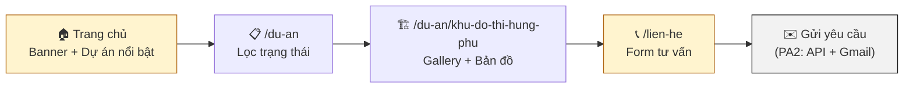
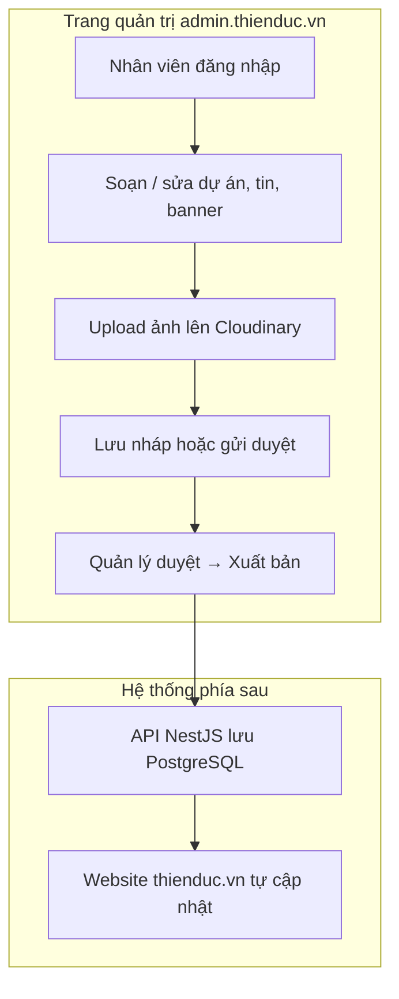
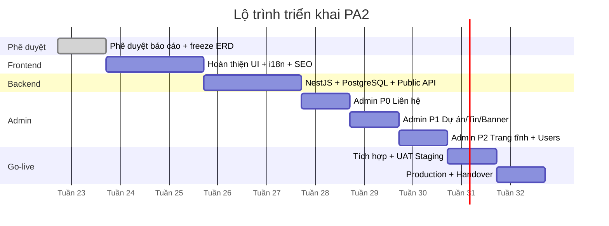

# Minh họa báo cáo Phương án 2 — Website Thiên Đức

Tài liệu này chứa **sơ đồ và wireframe** thay thế ảnh chụp màn hình trong báo cáo chính. Các sơ đồ Mermaid render trực tiếp trên GitHub / VS Code / Cursor.

> **Ảnh chụp thật:** Chạy `npm run build && npm run start`, mở `http://localhost:3000` và chụp 4 màn hình: Trang chủ (desktop), Menu mobile, Chi tiết dự án Hưng Phú, Trang liên hệ — lưu vào `docs/screenshots/`.

---

## H1 — Luồng khách hàng điển hình



---

## H2 — Quy trình cập nhật nội dung (Admin CMS — PA2)



---

## H3 — Wireframe Trang chủ (desktop)

```
┌──────────────────────────────────────────────────────────────────────────┐
│ TOP STRIP: 📍 Địa chỉ          │  📞 Phone  │  ✉ Email                  │
├──────────────────────────────────────────────────────────────────────────┤
│ [LOGO Thiên Đức]  Trang chủ Giới thiệu Dự án▾ Tin tức CTTV Nhân sự▾ Liên hệ  [🔍] [VI|EN] │
├──────────────────────────────────────────────────────────────────────────┤
│                                                                          │
│              ╔══════════════════════════════════════════╗                │
│              ║     BANNER SLIDER (4 ảnh Hưng Phú)       ║                │
│              ╚══════════════════════════════════════════╝                │
│                                                                          │
│  ── Giới thiệu ngắn + CTA ──                                             │
│                                                                          │
│  ┌─────────┐ ┌─────────┐ ┌─────────┐ ┌─────────┐                        │
│  │ Dự án 1 │ │ Dự án 2 │ │ Dự án 3 │ │ Dự án 4 │  ← Featured Projects   │
│  └─────────┘ └─────────┘ └─────────┘ └─────────┘                        │
│                                                                          │
│  ┌──────┐ ┌──────┐ ┌──────┐ ... (7 lĩnh vực xây dựng)                   │
│  │Lĩnh  │ │Lĩnh  │ │Lĩnh  │                                              │
│  │vực 1 │ │vực 2 │ │vực 3 │                                              │
│  └──────┘ └──────┘ └──────┘                                              │
│                                                                          │
│  ── Tin tức mới ──              ── CTA Liên hệ ──                        │
├──────────────────────────────────────────────────────────────────────────┤
│ FOOTER: Thông tin công ty | Link nhanh | Phone | Email | Bản đồ        │
└──────────────────────────────────────────────────────────────────────────┘
```

---

## H4 — Wireframe Admin Dashboard (PA2)

```
┌──────────────────────────────────────────────────────────────────────────┐
│ [≡] Thiên Đức Admin                              Nguyễn A ▾  [Đăng xuất] │
├────────────┬─────────────────────────────────────────────────────────────┤
│ Dashboard  │  TỔNG QUAN                                                  │
│ ─────────  │  ┌──────────┐ ┌──────────┐ ┌──────────┐ ┌──────────┐        │
│ Nội dung   │  │ Liên hệ  │ │ Bài nháp │ │ Dự án    │ │ Tin chờ  │        │
│  · Banner  │  │ mới: 3   │ │ tin: 2   │ │ active:8 │ │ duyệt: 1  │        │
│  · Dự án   │  └──────────┘ └──────────┘ └──────────┘ └──────────┘        │
│  · Tin tức │                                                             │
│  · Trang   │  LIÊN HỆ GẦN ĐÂY                                           │
│ Liên hệ    │  ┌────────────────────────────────────────────────────┐    │
│ Hệ thống   │  │ Nguyễn Văn A | 090x | Tư vấn dự án | NEW | 12/06  │    │
│  · Cài đặt │  │ Trần Thị B   | 091x | Hợp tác      | NEW | 11/06  │    │
│  · Tài khoản│ └────────────────────────────────────────────────────┘    │
└────────────┴─────────────────────────────────────────────────────────────┘
```

---

## H5 — Wireframe Admin — Sửa dự án

```
┌──────────────────────────────────────────────────────────────────────────┐
│ Sửa dự án: Khu đô thị Hưng Phú                    [Lưu nháp] [Publish]  │
├──────────────────────────────────────────────────────────────────────────┤
│ Tên (VI) [________________________]  Tên (EN) [________________________] │
│ Slug     [khu-do-thi-hung-phu    ]  Trạng thái [Đang thi công ▾]        │
│ Tóm tắt  [________________________________________________________]     │
│ Mô tả    [ Rich text editor .................................... ]     │
│                                                                          │
│ HẠNG MỤC CON                          GALLERY                            │
│ + Khách sạn                           [Upload ảnh Cloudinary]            │
│ + Fancy Tower                         ┌────┐ ┌────┐ ┌────┐              │
│ + Siêu thị                            │img │ │img │ │img │              │
│                                       └────┘ └────┘ └────┘              │
│ BẢN ĐỒ: [URL ảnh] [Google Maps link] [Marker X/Y]                       │
└──────────────────────────────────────────────────────────────────────────┘
```

---

## H6 — Biểu đồ Gantt (8–10 tuần)



---

## H7 — Export sơ đồ draw.io sang PNG

| File nguồn | Nội dung | Cách export |
|------------|----------|-------------|
| `docs/diagrams/01-dang-nhap.drawio` | Luồng đăng nhập admin | Mở draw.io → File → Export as PNG |
| `docs/diagrams/02-form-lien-he.drawio` | Luồng form liên hệ | Cập nhật lane Admin = Vite+React trước khi export |
| `docs/diagrams/03-upload-anh.drawio` | Upload Cloudinary | Export PNG |

---

## H8 — Checklist screenshot cần chụp thủ công

| ID | Màn hình | Viewport | Trạng thái |
|----|----------|----------|------------|
| S01 | Trang chủ | Desktop 1440px | ☐ Chưa chụp |
| S02 | Menu mobile | iPhone 390px | ☐ Chưa chụp |
| S03 | Chi tiết Hưng Phú | Desktop | ☐ Chưa chụp |
| S04 | Trang liên hệ | Desktop | ☐ Chưa chụp |
| S05 | Lighthouse mobile | Chrome DevTools | ☐ Chưa chụp |
| S06 | Homepage Coteccons | Desktop (đối chiếu) | ☐ Chưa chụp |
| S07 | Homepage Đất Xanh | Desktop (đối chiếu) | ☐ Chưa chụp |
